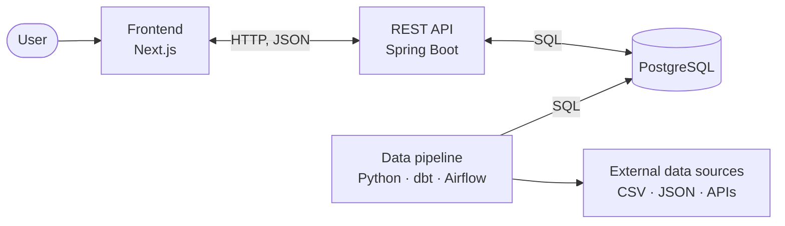

# HackYourFuture Final Project

> **Using this template?** Everything marked **TODO** is yours to fill in or delete. .

This is our final project for the [HackYourFuture program](https://hackyourfuture.net/program), built as a
team with three roles — frontend, backend, and data engineering. We worked in an agile way, in short
sprints, supported by a group of mentors: Product Manager and a Tech Lead. The project is open source and available on GitHub.

### 🌐 [Live demo](https://your-app.example.com)

> **TODO: Point the link above at your deployed app,** or remove this section if the project is not
> deployed. A visitor who can click through to a working app is worth more than any description.

---

## Table of contents

- [About the project](#about-the-project)
- [Screenshots](#screenshots)
- [Features](#features)
- [Tech stack](#tech-stack)
- [Architecture](#high-level-architecture)
- [Project structure](#project-structure)
- [Documentation](#documentation)
- [CI/CD](#cicd)
- [Team](#team)
- [Roadmap](#roadmap)

---

## About the project

> **TODO: a short description about your app.** 
> What problem does it solve? Who is it for? What
> makes it interesting? Write it for someone who has never heard of the project.

## Screenshots

> **TODO: Replace the placeholder below with real screenshots of your app.** Put the image files in
> the [`screenshots/`](screenshots) folder. Two or three shots of the most important screens work
> better than ten of everything.


## Features

> **TODO: List what your app can actually do.** Describe features from the user's point of view
> (e.g.: "Search for recipes by ingredient").

- Feature 1
- Feature 2
- Feature 3

## Tech stack

| Layer | Technologies |
| --- | --- |
| **Frontend** | Next.js, React, TypeScript, Biome |
| **Backend** | Java 25, Spring Boot, PostgreSQL, Flyway, Maven |
| **Data** | Python, SQL, dbt, PostgreSQL, Databricks, Airflow |
| **Infrastructure** | Docker, Docker Compose, GitHub Actions, GitHub Container Registry |

## High-level Architecture



## Project structure

```
.
├── backend/            Spring Boot REST API (Java, Maven, Flyway)
├── frontend/           Next.js web app (TypeScript, React)
├── data/               Data pipeline (Python, dbt, Airflow)
├── scripts/            Scripts for local development and deployment
├── screenshots/        Images used in this README
├── .github/workflows/  CI/CD pipelines and other workflows
```

## Documentation

| What | Where |
| --- | --- |
| Frontend guide | [`frontend/README.md`](frontend/README.md) |
| Backend guide | [`backend/README.md`](backend/README.md) |
| Data pipeline guide | [`data/README.md`](data/README.md) |
| Live API reference (Scalar) | http://server-host/api/docs |

The API documentation is generated from the backend code at runtime, so it is never out of date —
there is no `openapi.yaml` file to maintain by hand.


## CI/CD

Two GitHub Actions workflows run automatically:

| Workflow | Triggers on | What it does |
| --- | --- | --- |
| [Backend CI/CD](.github/workflows/backend-ci-cd.yaml) | changes under `backend/**` | Checkstyle, tests, Docker build; pushes the image to GHCR on `main` |
| [Frontend CI/CD](.github/workflows/frontend-ci-cd.yaml) | changes under `frontend/**` | Lint, build, Docker build; pushes the image to GHCR on `main` |

Pull requests are only merged when their checks pass.


## Team

> **(Optional) TODO: Fill in your team.** It's nice to give credit to the people who worked on the project. Make sure to ask for permission before you put anyone's name on the internet.

| Name | Role | GitHub |
| --- | --- | --- |
| Name | Frontend | [@username](https://github.com/username) |
| Name | Backend | [@username](https://github.com/username) |
| Name | Data engineering | [@username](https://github.com/username) |

## Roadmap

> **TODO: What is next?** An honest list of what is not built yet shows the reader you understand
> your own project.

- [ ] Planned improvement 1
- [ ] Planned improvement 2

