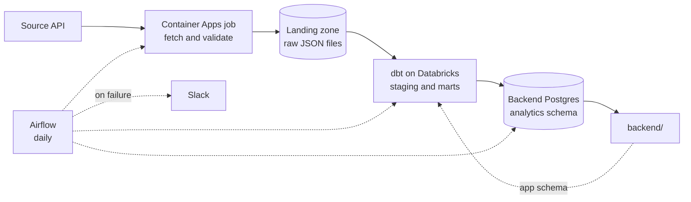

# Final Project Data Pipeline

The starting shape for the data half of the final project. It gives you the
folders, the wiring, and the conventions. It does not give you a working
pipeline: the parts that matter are yours to write, and they are marked `TODO`
with a docstring saying what each one has to do.

## The pipeline you are building



Every team runs this shape: ingestion in a container, raw files in your team's
landing zone, dbt building models in your team's catalog, and Airflow
publishing the finished mart into the database the backend reads.

Your raw files live in your team's own storage account, in a container called
`landing`. That same container is registered in Unity Catalog as a volume, so
the file the container writes as `landing/raw/postings/2026-08-12.json` is the
file dbt reads at `/Volumes/<your catalog>/landing/raw/postings/`. One copy of
the bytes, two ways to reach it: Azure tooling on one side, SQL on the other.

The two tracks meet through two schemas in the backend's database, and each
side owns the one it writes. You publish marts into `analytics`, which the
backend reads. The backend exposes views in `app`, which you read. Neither side
reads the other's internal tables, so a migration on their side cannot silently
break your DAG.

## What you get, and what you write

| Path | State |
|---|---|
| `src/config.py` | **Done.** Reads settings from the environment and fails loudly when one is missing |
| `src/models.py` | **Example.** A Pydantic model for job postings. Replace it with your source's shape |
| `src/ingest.py` | **Done.** Calls the API, validates, counts rejects |
| `src/storage.py` | **Done.** Lands raw JSON in your team's landing zone |
| `src/sync.py` | **You write it.** Publish a mart into the backend's database |
| `src/pipeline.py` | **Done.** Wires fetch, validate and land together |
| `dbt/models/staging/` | **Skeleton.** Reads the volume with `read_files`. Rename to your domain |
| `dbt/models/marts/fct_postings.sql` | **Skeleton.** This is the contract with the backend |
| `dbt/tests/` | **Example.** Two custom tests, including a zero-row check |
| `airflow/dags/pipeline_dag.py` | **Skeleton.** Three tasks wired in order, bodies empty |
| `airflow/dags/alerts.py` | **Done.** Posts to Slack when any task fails |
| `Dockerfile` | **Done.** The image you push to Azure Container Registry |
| `optional/` | A Streamlit operations dashboard. Not required |

## Setup

Most of this was done for you when your repository was created. What is already
in place:

- your team's storage account, Databricks catalog, SQL warehouse and secret
  scope, and a Container Apps job to run your image
- your Airflow instance, already pulling this repository every minute, with
  every value it needs set as an Airflow Variable
- CI that builds your ingestion image and pushes it to your team's registry on
  every merge to `main`, with no credential stored anywhere
- a Slack channel that receives an alert whenever a task fails

What you do once, on your own machine:

**1. Get your team's values.** Your teacher gives you four: your storage
account name, your catalog, your SQL warehouse path, and your team letter.
Everything else is the same for all three teams and is already filled in.

You also need your team's Databricks client id and secret, which dbt and the
publish step use. Do not ask for those: read them yourself, so they are never
pasted into a chat message.

```bash
az keyvault secret show --vault-name kv-hyf-data \
  --name fp-databricks-client-id-team-<x> --query value -o tsv
az keyvault secret show --vault-name kv-hyf-data \
  --name fp-databricks-client-secret-team-<x> --query value -o tsv
```

**2. Fill in `.env`.**

```bash
cd data
cp .env.example .env      # then paste in the four values from step 1
```

**3. Sign in to Azure.** The pipeline authenticates as you locally, and as its
managed identity in Azure. Same code, no secret either way.

```bash
az login
```

**4. Check you can reach your landing zone.** Your teacher grants each team
member `Storage Blob Data Contributor` on your storage account. Owner or
Contributor on the resource group is *not* enough: Azure separates managing a
storage account from reading what is inside it, and this trips up nearly
everyone the first time.

```bash
az storage blob list --account-name <your storage account> \
  --container-name landing --auth-mode login -o table
```

An `AuthorizationPermissionMismatch` here means the role is missing or has not
propagated yet. It can take a few minutes after it is granted.

**5. Install and run.**

```bash
uv sync --extra dbt --extra sync
uv run python -m src.pipeline
```

That fetches the default source and lands one file. Check it arrived, from the
Databricks SQL editor:

```sql
SELECT count(*) FROM read_files('/Volumes/<your catalog>/landing/raw/postings',
                                format => 'json');
```

**6. Point dbt at your landing zone, then build.**

`dbt/dbt_project.yml` ships `landing_path: /Volumes/CHANGE_ME/...`. Change it to
your own volume once, then:

```bash
cd dbt
uv run --env-file ../.env dbt build
```

`--env-file` matters: `dbt/profiles.yml` reads every value from the
environment, and `uv run` does not pick up `.env` on its own.

> ⚠️ If `DATABRICKS_CLIENT_ID` or `DATABRICKS_CLIENT_SECRET` is empty, dbt does
> not fail. It falls back to interactive sign-in and waits for a browser that
> never opens, so the command simply hangs. If `dbt build` produces no output
> for a minute, check those two values first.

When staging reads your own file, you have an end to end path, and everything
after that is shaping.

### Running the whole stack locally

All three start from the repository root:

```bash
cp .env.example .env && docker compose up -d db       # the backend's database
docker compose build pipeline                         # the image CI will build
cd data/airflow && cp .env.example .env && astro dev start
```

Build the image locally, but do not expect to run it locally. Inside the
container there is no `az login` and no Azure metadata service, so
`DefaultAzureCredential` has nothing to authenticate with and the run ends in a
wall of "credential unavailable" messages. That is correct behaviour: the image
gets its identity from Azure when the Container Apps job runs it. To exercise
the ingestion on your machine, use `uv run python -m src.pipeline`, which
authenticates as you.

## Making it yours

The template ships a job-postings example so the shape is concrete. Swapping in
your team's source is four edits:

1. `.env`: point `SOURCE_API_URL` and `SOURCE_NAME` at your source.
2. `src/models.py`: change the model to match your records.
3. `dbt/models/`: rename the models and columns to your domain.
4. `dbt/models/marts/_fct_postings.yml`: rewrite the contract.

Do this in your first two days. Everything after that builds on the shape you
choose here.

> Verify your source before you commit to it: call it once, print a record, and
> confirm you can parse it. An idea you love with a source you cannot reach is
> worth less than a plain idea that works.

## The mart is a contract

`fct_postings` is what the backend reads. Airflow copies it into their database
after dbt succeeds, so whatever you select there is what they get. Adding a
column is safe. Renaming or removing one breaks them, so agree it first and
change both sides at once.

Every column is documented in `dbt/models/marts/_fct_postings.yml`. Hand that
file to the backend trainees on day one and they can write endpoints before
your pipeline is finished. See `docs/mart_contract.md` for how to work on it
together.

## Secrets

No credentials live in this folder. `dbt/profiles.yml` is committed on purpose:
every value in it comes from `env_var(...)`, so it holds nothing secret. Real
values live in `.env`, which is git-ignored, in Key Vault, and in your team's
Databricks secret scope.

Never commit `.env`, and never paste a token or connection string into a chat
message or an LLM prompt.
