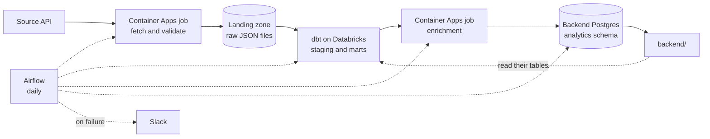

# Final Project Data Pipeline

The data half of the final project. **It runs end to end as it stands**, against
a public job board, on your team's own infrastructure. Nothing here is a stub
waiting to be filled in.

That is deliberate. You learn more from a pipeline that works and has to be
changed than from a set of empty functions: you can run it on day one, see real
rows arrive, break something, and watch which test catches it. Your job is to
make it yours, which is a different and more interesting problem than making it
exist.

## The pipeline



Every team runs this shape: ingestion in a container, raw files in your team's
landing zone, dbt building and testing models in your team's catalog, a second
container adding what SQL cannot express, and Airflow publishing the finished
mart into the database the backend reads.

Both container jobs run the same image. They differ only in the command, which
is why there is one thing to build and one tag to keep track of.

Your raw files live in your team's own storage account, in a container called
`landing`. That same container is registered in Unity Catalog as a volume, so
the file the container writes as `landing/raw/postings/2026-08-12.json` is the
file dbt reads at `/Volumes/<your catalog>/landing/raw/postings/`. One copy of
the bytes, two ways to reach it: Azure tooling on one side, SQL on the other.

The two tracks meet through two schemas in the backend's database, and each
side owns the one it writes. You publish marts into `analytics`, which the
backend reads. The backend exposes views in `app`, which you read. Neither side
reads the other's internal tables, so a migration on their side cannot silently
break your DAG.

## What is where

Everything below works. The "change this" column says what a team normally
edits, not what is missing.

| Path | What it does | Change this? |
|---|---|---|
| `src/models.py` | A Pydantic model for job postings | Yes: your source's shape |
| `src/ingest.py` | Calls the API, validates, counts rejects | The parsing, if your source is nested |
| `src/storage.py` | Lands raw JSON in your team's landing zone | Rarely |
| `src/pipeline.py` | The ingestion job: settings, fetch, validate, land | Rarely |
| `src/enrich.py` | The enrichment job: classifies each posting in Python | Yes: this is your domain logic |
| `src/warehouse.py` | Runs SQL against your warehouse over HTTP | No |
| `src/sync.py` | Publishes the mart into the backend's database, atomically | Rarely |
| `src/aca.py` | Starts a container job and waits for it | No |
| `dbt/models/` | Staging reads the volume, the mart is the contract | Yes: your domain |
| `dbt/tests/` | Two custom tests, including a zero-row check | Add your own |
| `tests/` | Unit tests, no credentials needed, under a second | Add as you build |
| `airflow/dags/pipeline_dag.py` | The four tasks, wired in order | Only to add a step |
| `airflow/dags/alerts.py` | Posts to Slack when any task fails | No |
| `Dockerfile` | The one image both container jobs run | Rarely |
| `optional/` | A health dashboard and a dbt-results recorder. Neither required | As you like |

## Setup

Most of this was done for you when your repository was created. What is already
in place:

- your team's storage account, Databricks catalog, SQL warehouse and secret
  scope, and a Container Apps job to run your image
- your Airflow instance, already pulling this repository every minute, with
  the values it needs already set
- CI that builds the pipeline image and pushes it to your team's registry on
  every merge to `main`, with no credential stored anywhere
- a Slack channel that receives an alert whenever a task fails

What you do once, on your own machine:

**1. Get your team's values.** Your teacher gives you two: your storage account
name and your catalog. Everything else is the same for all three teams and is
filled in already.

You also need your team's Databricks client id and secret, which dbt and the
publish step use. Do not ask for those: read them yourself, so they are never
pasted into a chat message.

```bash
az keyvault secret show --vault-name kv-hyf-data \
  --name fp-databricks-client-id-team-<x> --query value -o tsv
az keyvault secret show --vault-name kv-hyf-data \
  --name fp-databricks-client-secret-team-<x> --query value -o tsv
```

**2. Fill in `.env`.**

```bash
cd data
cp .env.example .env      # then paste in the four values from step 1
```

**3. Sign in to Azure.** The pipeline authenticates as you locally, and as its
managed identity in Azure. Same code, no secret either way.

```bash
az login
```

**4. Check you can reach your landing zone.** Your teacher grants each team
member `Storage Blob Data Contributor` on your storage account. Owner or
Contributor on the resource group is *not* enough: Azure separates managing a
storage account from reading what is inside it, and this trips up nearly
everyone the first time.

```bash
az storage blob list --account-name <your storage account> \
  --container-name landing --auth-mode login -o table
```

An `AuthorizationPermissionMismatch` here means the role is missing or has not
propagated yet. It can take a few minutes after it is granted.

**5. Install and run.**

```bash
uv sync --extra dbt --extra sync
uv run python -m src.pipeline
```

That fetches the default source and lands one file. Check it arrived, from the
Databricks SQL editor:

```sql
SELECT count(*) FROM read_files('/Volumes/<your catalog>/landing/raw/postings',
                                format => 'json');
```

**6. Point dbt at your landing zone, then build.**

`dbt/dbt_project.yml` ships `landing_path: /Volumes/CHANGE_ME/...`. Change it to
your own volume once, then:

```bash
cd dbt
uv run --env-file ../.env dbt build
```

`--env-file` matters: `dbt/profiles.yml` reads every value from the
environment, and `uv run` does not pick up `.env` on its own.

> ⚠️ If `DATABRICKS_CLIENT_ID` or `DATABRICKS_CLIENT_SECRET` is empty, dbt does
> not fail. It falls back to interactive sign-in and waits for a browser that
> never opens, so the command simply hangs. If `dbt build` produces no output
> for a minute, check those two values first.

When staging reads your own file, you have an end to end path, and everything
after that is shaping.

**7. Run the enrichment.** It reads the mart dbt just built, classifies every
posting, and writes `fct_postings_enriched` next to it.

```bash
uv run python -m src.enrich
```

**8. Run the tests.** They need no credentials and no network, so they are the
one thing you can run before anything else works.

```bash
uv sync --extra dev
uv run pytest
```

They run in under a second. They cover the parts that are painful
to test any other way: what happens to a malformed record, whether the job poll
loop notices a failed container, and whether the publish swaps its tables in an
order that never leaves the backend looking at a missing one. Add to them as
you go, and CI runs them on every pull request.

## Developing locally

Everything except the two container jobs runs on your machine, against your
own copy of the data. The isolation comes from four settings in `.env`, and
they are the first thing to fill in:

| Setting | Yours | The scheduled run |
|---|---|---|
| `LANDING_PREFIX` | `dev/your-name` | `raw` |
| `LANDING_PATH` | `/Volumes/<catalog>/landing/dev/your-name/postings` | `.../landing/raw/postings` |
| `DBT_SCHEMA` | `dev_yourname` | `analytics` |
| `BACKEND_PG_PUBLISH_SCHEMA` | `analytics_dev` | `analytics` |

Your team's catalog has two volumes for this: `raw`, which the scheduled
pipeline writes and everybody's models read, and `dev`, which is yours to
scribble in. Nothing you do under `dev/your-name` can affect what the team's
models see.

The loop, start to finish:

```bash
uv run pytest                              # no credentials needed at all
uv run python -m src.pipeline              # lands in dev/your-name
cd dbt && uv run --env-file ../.env dbt build && cd ..   # builds dev_yourname
uv run python -m src.enrich                # adds discipline, same schema
```

`dbt build` needs no `--vars`: it reads `LANDING_PATH` from the same `.env`
your ingestion wrote to, so the two cannot disagree. In VS Code, point the dbt
extension at `data/dbt` and it picks up the same profile.

### The last step, in Airflow

```bash
cp .env.example .env && docker compose up -d db      # repo root, first
cd data/airflow && astro dev start
```

`astro dev start` prints the UI address, `http://airflow.localhost:6563` on
current versions. Astro reads your `data/.env`, so a task running there uses your prefix, your
schema and your database. It overrides three values, because inside a
container `localhost` means the container itself: the database is reached as
`db` on 5432, with `sslmode=prefer` since the local Postgres has no
certificate.

Run the publish step against your own schema:

```bash
docker exec -it $(docker ps -qf name=scheduler) \
  airflow tasks test final_project_pipeline publish_to_backend $(date +%F)
```

It reads `<catalog>.dev_yourname.fct_postings_enriched` and writes
`analytics_dev.fct_postings` in the compose database, which `data/local/`
creates when the database first starts. `dbt_build` runs the same way. The
`ingest` and `enrich` tasks do not: they start Container Apps jobs, which
needs the VM's identity, so run those two as the scripts above.

> The same DAG file runs in both places. It reads a secret from your `.env`
> when there is one and from Key Vault when there is not, so nothing has to be
> commented out or stubbed to make local work.

## Keeping the code tidy

Four tools, each with one job, all installed by `uv sync --extra dev` and all
run by CI on every pull request:

```bash
uv run ruff check .                     # mistakes: unused imports, bugs, naive datetimes
uv run black .                          # Python layout
uv run sqlfmt dbt/models dbt/tests      # SQL layout
uv run ty check src tests               # types
```

Run them before you push and the pull request goes green first time. Two of
them will teach you something the first week: `ruff` refuses a `datetime` with
no timezone, and `ty` refuses SQL built by pasting a name into a string, which
is why `src/sync.py` composes statements with `psycopg.sql` instead.

### Running the whole stack locally

All three start from the repository root:

```bash
cp .env.example .env && docker compose up -d db       # the backend's database
docker compose build pipeline                         # the image CI will build
cd data/airflow && cp .env.example .env && astro dev start
```

Build the image locally, but do not expect to run it locally. Inside the
container there is no `az login` and no Azure metadata service, so
`DefaultAzureCredential` has nothing to authenticate with and the run ends in a
wall of "credential unavailable" messages. That is correct behaviour: the image
gets its identity from Azure when the Container Apps job runs it. To exercise
the ingestion on your machine, use `uv run python -m src.pipeline`, which
authenticates as you.

## Making it yours

The template ships a job-postings example so the shape is concrete. Swapping in
your team's source is five edits:

1. `.env`: point `SOURCE_API_URL` and `SOURCE_NAME` at your source.
2. `src/models.py`: change the model to match your records.
3. `dbt/models/`: rename the models and columns to your domain.
4. `dbt/models/marts/_fct_postings.yml`: rewrite the contract.
5. `src/enrich.py`: replace the classifier with whatever your product needs.

Do this in your first two days. Everything after that builds on the shape you
choose here.

> Verify your source before you commit to it: call it once, print a record, and
> confirm you can parse it. An idea you love with a source you cannot reach is
> worth less than a plain idea that works.

## The landing zone

Raw files, not tables. A raw file is exactly what the source sent you, so when
a column changes shape in three weeks you can re-read it and find out when.

Your team's storage account has a `landing` container, registered in Unity
Catalog as an external volume. The file the job writes as
`landing/raw/postings/2026-08-12.json` is the file dbt reads at
`/Volumes/<catalog>/landing/raw/postings/`. One copy of the bytes, two ways to
reach it. `volume_path()` returns the second form, which is what goes in
`dbt_project.yml`.

One file per source per day, so a re-run replaces its own file instead of
doubling your data. Change the layout if you like, but change `landing_path` in
`dbt_project.yml` to match.

**Raw means raw.** The job validates before it writes, but it lands what the
source sent, not what validation produced. Parsing is a gate deciding whether
the run is worth landing, not a transformation. Write the parsed objects
instead and the "raw" file quietly carries your own type coercions, so
re-reading it after a source change tells you about your bug rather than
theirs. An empty batch raises: landing zero rows leaves yesterday's mart in
place with every test still passing, and nobody finds out for a week.

## Talking to the warehouse

`src/warehouse.py` sends statements over the Statement Execution API, which is
plain HTTPS. `databricks-sql-connector` would do the same over Thrift and a
much larger dependency tree.

The one thing that surprises everybody: your team's service principal
authenticates at **Microsoft Entra**, not at the Databricks workspace. The
workspace's own `/oidc/v1/token` endpoint returns 401 for principals created
this way, and the error does not hint that you are knocking on the wrong door.

## Why there is a second container

dbt already runs SQL against the warehouse, so anything expressible as SQL
belongs in a dbt model, where it is tested, documented and rebuilt with
everything else. The enrichment job exists for the work that is not SQL.

Here it reads each job title and decides which discipline the posting belongs
to. As SQL that is a hundred-line `CASE` nobody dares change; as Python it is a
dictionary with unit tests, and the day you replace it with a real model or a
call to another service, only `src/enrich.py` changes.

Keep that seam. Things that belong in the container rather than in dbt: calling
another service, anything with a library behind it, and anything you want to
test with `pytest` rather than with a dbt test.

## What runs in Airflow

Four tasks, in order: `ingest`, `dbt_build`, `enrich`, `publish_to_backend`.
The order is the point. Publishing a mart that failed its own tests is worse
than publishing nothing, and the dependency is what stops it. Separate tasks
also mean that when dbt fails you re-run dbt, not the fetch.

Every setting lives in the Airflow UI, under **Admin -> Variables**, and is
read when the task runs. You are an admin on your team's instance, so changing
where the pipeline points is a change you make yourself, in one place your
whole team can see, with no deploy:

`TEAM`, `AZURE_SUBSCRIPTION`, `AZURE_RESOURCE_GROUP`, `ACA_INGEST_JOB`,
`ACA_ENRICH_JOB`, `DATABRICKS_HOST`, `DATABRICKS_HTTP_PATH`,
`DATABRICKS_CATALOG`, `DBT_SCHEMA`, `AZURE_TENANT_ID`, `BACKEND_PG_HOST`,
`BACKEND_PG_DB`.

They are set for you when your team is provisioned. Miss one and the task that
needs it fails saying which one, rather than doing something surprising.

Secrets are not among them. Each one is fetched from Key Vault inside the task
that needs it, using the machine's own identity, so nothing is stored on the VM
and a typo fails with a 403 rather than reaching another team's data.

The DAG imports the same `src` package the containers run, so the publish logic
exists once. It is mounted inside the dags folder, which Airflow puts on the
Python path, so there is no PYTHONPATH to configure. A task failing with
`ModuleNotFoundError: src` means that mount is missing: a teacher question,
not something to work around in the DAG.

### Reading the app's data

The other direction: your credential can read the backend's own tables, so a
model can join against how the application is actually being used.
`src/sync.py` has `read_backend_table` ready for it. Add a task once you have
agreed with the backend which table you are reading, and keep it before
`dbt_build` so the models can use what it lands.

Agreeing it matters more than it sounds. Their tables are theirs to change, and
nothing warns you when they do: a column you depend on can disappear in a
migration you never saw. Read as little as you need, and tell them what you
read.

## The two schemas

The two tracks meet in the backend's database, which has one schema per side:

- **`analytics`** — you write, the backend reads. Your published marts.
- **`public`** — the backend writes, you read. Their operational tables.

Neither side can write to the other's schema. That is what stops a stray
publish from corrupting the application, and stops a backend deploy from
overwriting your marts.

Anything personal is your problem to handle the moment you read it. Hash it or
drop it in your staging model, so it never reaches a mart and never leaves the
warehouse.

### The write-then-swap

The publish must never leave a half-loaded table where the backend can see it,
so loading and switching are separated:

1. create `<table>__staging`, empty
2. insert every row
3. in one transaction: `drop table if exists <table>`, then rename staging into
   its place

Note the `if exists`. The obvious version renames the current table out of the
way first, which cannot work the very first time you publish, because there is
nothing to rename: the sync then fails exactly once, on the run you most want
to succeed.

## The mart is a contract

`fct_postings` is what dbt builds and `fct_postings_enriched` is what gets
published, under the name `analytics.fct_postings` in the backend's database.
Adding a column is safe. Renaming or removing one breaks them, so agree it
first and change both sides at once.

Every column is documented in `dbt/models/marts/_fct_postings.yml`. Hand that
file to the backend trainees on day one and they can write endpoints before
your pipeline is finished. See `docs/mart_contract.md` for how to work on it
together.

## Alerting

`airflow/dags/alerts.py` posts to your team's Slack channel when any task
fails. It is attached once in `default_args`, so every task inherits it,
including tasks you add later: alerting you have to remember is alerting you
will forget.

Airflow's own behaviour on failure is to colour a square red and wait for
somebody to look. Nobody looks at 6am, which is when your pipeline runs.

## Secrets

No credentials live in this folder. `dbt/profiles.yml` is committed on purpose:
every value in it comes from `env_var(...)`, so it holds nothing secret. Real
values live in `.env`, which is git-ignored, in Key Vault, and in your team's
Databricks secret scope.

Never commit `.env`, and never paste a token or connection string into a chat
message or an LLM prompt.
