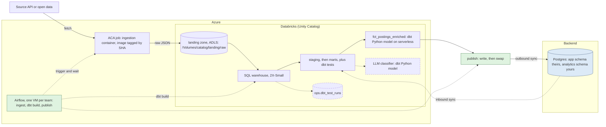
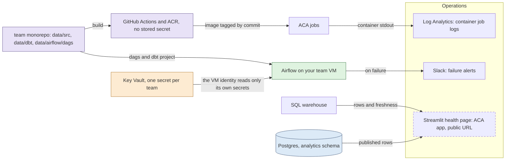

# Final Project Data Pipeline

The data half of the final project. **It runs end to end as it stands**, against
a public job board, on your team's own infrastructure. Nothing here is a stub
waiting to be filled in.

That is deliberate. You learn more from a pipeline that works and has to be
changed than from a set of empty functions: you can run it on day one, see real
rows arrive, break something, and watch which test catches it. Your job is to
make it yours, which is a different and more interesting problem than making it
exist.

## The pipeline



This is the Week 15 course architecture drawn for one team rather than all
three. Dashed nodes are optional: the project is complete without them.

Everything around that pipeline, the parts you do not build yourself:



The Databricks box is the part of your work nobody outside the data track ever
sees. Staging, intermediate models and every model you build while figuring the
data out live in your catalog. Only the marts cross into Postgres, and only
through the sync task in Airflow.

Three things in that picture are provided for you rather than built by you. CI
builds the image and pushes it to your registry with no credential stored
anywhere, Key Vault holds the one secret your Airflow VM may read, and the
Slack alert is already wired to every task.

Every team runs this shape: ingestion in a container, raw files in your team's
landing zone, dbt building and testing models in your team's catalog, and
Airflow publishing the finished mart into the database the backend reads.

**Enrichment is a dbt model, not a separate job.** The work that SQL expresses
badly, here deciding which discipline a job title belongs to, lives in
`dbt/models/marts/fct_postings_enriched.py`, a **dbt Python model** running on
Databricks serverless. It is a node in the graph like any `.sql` file, so
`dbt build` runs it in order after `fct_postings`, `ref()` works, and its
output is tested in `_fct_postings_enriched.yml`. There is no cluster to start
and no fourth task to trigger and wait for.

There is a second, optional Python model beside it. `fct_title_discipline.py`
does the same classification with an LLM instead of a dictionary, and ships
with `enabled: false` because it needs an API key first. See
[`optional/README.md`](optional/README.md) for the key and the daily request
limit.

Your raw files live in your team's own storage account, in a container called
`landing`. That same container is registered in Unity Catalog as a volume, so
the file the container writes as
`landing/raw/postings/ingest_date=2026-08-12/data.json` is the file dbt reads
at `/Volumes/<your catalog>/landing/raw/postings/`. One copy of the bytes, two
ways to reach it: Azure tooling on one side, SQL on the other.

The two tracks meet in the backend's database, which has one schema per side.
You write marts into `analytics`, which the backend reads. The backend writes
`app`, which you can read. Neither side can write to the other's, and that is
two Postgres roles rather than an agreement.

## What is where

Everything below works. The "change this" column says what a team normally
edits, not what is missing.

The Python is grouped by pipeline stage, so the folders match the boxes in the
diagram above. `common/` is what more than one stage needs.

| Path | What it does | Change this? |
|---|---|---|
| `src/ingestion/models.py` | A Pydantic model for job postings | Yes: your source's shape |
| `src/ingestion/ingest.py` | Calls the API, validates, counts rejects | The parsing, if your source is nested |
| `src/ingestion/storage.py` | Lands raw JSON in your team's landing zone | Rarely |
| `src/ingestion/pipeline.py` | The ingestion job's entrypoint: settings, fetch, validate, land | Rarely |
| `src/publishing/sync.py` | Publishes the mart into the backend's database, atomically | Rarely |
| `src/common/warehouse.py` | Runs SQL against your warehouse over HTTP | No |
| `src/common/aca.py` | Starts a container job and waits for it | No |
| `dbt/models/` | Staging reads the volume, the mart is the contract | Yes: your domain |
| `dbt/models/marts/fct_postings_enriched.py` | The enrichment model: classifies each posting in Python, on serverless | Yes: this is your domain logic |
| `dbt/models/marts/fct_title_discipline.py` | Optional: the same classification with an LLM, shipped disabled | Only if you turn it on |
| `dbt/tests/` | Two custom tests, including a zero-row check | Add your own |
| `tests/` | Unit tests, in folders mirroring `src/`. No credentials, under a second | Add as you build |
| `airflow/dags/pipeline_dag.py` | The three tasks, wired in order | Only to add a step |
| `airflow/dags/alerts.py` | Posts to Slack when any task fails | No |
| `Dockerfile` | The image the ingestion job runs | Rarely |
| `optional/` | A health dashboard and a dbt-results recorder. Neither required | As you like |

## Setup

Most of this was done for you when your repository was created. What is already
in place:

- your team's storage account, Databricks catalog, SQL warehouse and secret
  scope, and a Container Apps job to run your image
- your Airflow instance, already pulling this repository every minute, with
  the values it needs already set
- CI that builds the pipeline image and pushes it to your team's registry on
  every merge to `main`, with no credential stored anywhere
- a Slack channel that receives an alert whenever a task fails

What you do once, on your own machine:

**1. Get your team's values.** Your teacher gives you two: your storage account
name and your catalog. Everything else is the same for all three teams and is
filled in already.

**2. Generate your Databricks token.** The same one you made in Week 13, and
for the same reason: it authenticates dbt as *you*. Your name in the top bar,
**Settings**, **Developer**, **Access tokens**, **Generate new token**. Give it
a comment like `final-project` and copy the value once, because Databricks
will not show it again.

It is yours, not your team's. Paste it only into your local `.env`, never into
Slack, a pull request or an LLM prompt.

**3. Create your local database.** The backend's own script makes the
`project_db` database, the `app` and `analytics` schemas, and a login role for
each. Start the database first, from the repository root:

```bash
cd <repository root>
cp .env.example .env                 # the root one: Postgres container settings
docker compose up -d db
pip install "psycopg[binary]"
python scripts/db-setup.py --host localhost --port 5432 \
  --admin-user admin --admin-password password
```

Copy the `analytics_user` password it prints. It is shown once, and it is the
one your pipeline publishes with.

> ⚠️ If this fails with `role "admin" does not exist`, something else on your
> machine already owns port 5432, usually a Postgres you installed yourself.
> Stop it, or give the container a different port, and use that everywhere.

**4. Fill in `.env`.**

```bash
cd data
cp .env.example .env      # a different file: data/.env.example, the pipeline's
```

Fill in the two values from step 1, your token, and the `analytics_user`
password from step 3.

**5. Sign in to Azure.** The pipeline authenticates as you locally, and as its
managed identity in Azure. Same code, no secret either way.

```bash
az login
```

**6. Check you can reach your landing zone.** Your teacher grants each team
member two roles, one per container: `Storage Blob Data Contributor` on `dev`,
so your own runs can write there, and `Storage Blob Data Reader` on `landing`,
so you can read what the scheduled pipeline wrote without being able to
overwrite it. Owner or Contributor on the resource group is *not* enough:
Azure separates managing a storage account from reading what is inside it, and
this trips up nearly everyone the first time.

```bash
az storage blob list --account-name <your storage account> \
  --container-name landing --auth-mode login -o table
```

An `AuthorizationPermissionMismatch` here means the role is missing or has not
propagated yet. It can take a few minutes after it is granted.

**7. Install and run.**

```bash
uv sync --all-extras
uv run python -m src.ingestion.pipeline
```

`--all-extras`, not one extra at a time: `uv sync` makes the environment match
exactly what you asked for, so a later `uv sync --extra dev` would uninstall
dbt again.

That fetches the default source and lands one file. Check it arrived, from the
Databricks SQL editor:

```sql
SELECT count(*) FROM read_files('/Volumes/<your catalog>/landing/raw/postings',
                                format => 'json');
```

**8. Point dbt at your landing zone, then build.**

dbt reads `LANDING_PATH` from your `.env`, the same file your ingestion wrote
to, so the two cannot disagree. Step 7 printed the exact value to use as its
last line. Then:

```bash
cd dbt
uv run --env-file ../.env dbt show --inline "select session_user() as connected_as"
uv run --env-file ../.env dbt build
```

`session_user()` must show your own email. If it shows somebody else's, you
pasted the wrong token.

`--env-file` matters: `dbt/profiles.yml` reads every value from the
environment, and `uv run` does not pick up `.env` on its own.

> 💡 `dbt build` runs as you, through your own token. Airflow passes
> `--target prod` instead, which uses the team's service principal. Same
> project, same models, two identities: yours can build `dev_yourname` and
> cannot touch `analytics`, and the service principal is the only thing that
> publishes.

When staging reads your own file, you have an end to end path, and everything
after that is shaping.

**9. Run the tests.** They need no credentials and no network, so they are the
one thing you can run before anything else works.

```bash
uv run pytest
```

They run in under a second. They cover the parts that are painful
to test any other way: what happens to a malformed record, whether the job poll
loop notices a failed container, and whether the publish swaps its tables in an
order that never leaves the backend looking at a missing one. Add to them as
you go, and CI runs them on every pull request.

## Developing locally

Everything except the two container jobs runs on your machine, against your
own copy of the data. Five settings in `.env` decide where that copy lives,
and they are the first thing to fill in:

| Setting | Yours | The scheduled run |
|---|---|---|
| `LANDING_CONTAINER` | `dev` | `landing` |
| `LANDING_PREFIX` | `your-name` | `raw` |
| `LANDING_PATH` | `/Volumes/<catalog>/landing/dev/your-name/postings` | `.../landing/raw/postings` |
| `DBT_SCHEMA` | `dev_yourname` | `analytics` |
| `BACKEND_PG_PUBLISH_SCHEMA` | `analytics_dev` | `analytics` |
| `BACKEND_PG_USER` | `analytics_dev_user` | `analytics_user` |

This is not a naming convention you have to remember. It is what your account
is allowed to do. You can write the `dev` container and only read `landing`.
You can create and own `dev_` schemas and only read `analytics`. Point your
`.env` at the production names by mistake and the run stops with a permission
error, which is a much better afternoon than discovering at the demo that your
test data went out to the backend.

### Before any of that: look at the source

When you point the pipeline at a new API, the first question is what it
actually returns, and you do not need a cloud account to answer it:

```bash
uv run python -m src.ingestion.pipeline --local     # writes local-landing/
```

It fetches and validates exactly as a real run does, then writes the file to
your own disk instead of the landing zone, in the same newline-delimited format
dbt would read. Open it, work out which fields matter, and write the renames in
`stg_*.sql` against something you have seen rather than something you assume.
`--local` takes an optional directory if you want it somewhere else, and it is
the one mode that needs no `STORAGE_ACCOUNT`.

> This is a look, not a stage. The SQL warehouse cannot read your laptop, so
> there is no step where you land locally and then upload it. When the shape
> looks right, drop the flag and the same command writes the `dev` container.

The loop, start to finish:

```bash
uv run pytest                              # no credentials needed at all
uv run python -m src.ingestion.pipeline              # lands in dev/your-name
cd dbt && uv run --env-file ../.env dbt build && cd ..   # builds dev_yourname,
                                           # including the enrichment model
```

`dbt build` needs no `--vars`: it reads `LANDING_PATH` from the same `.env`
your ingestion wrote to, so the two cannot disagree. In VS Code, point the dbt
extension at `data/dbt` and it picks up the same profile.

### The last step, in Airflow

```bash
cd data/airflow && astro dev start
```

`astro dev start` prints the UI address, `http://airflow.localhost:6563` on
current versions. Astro reads your `data/.env`, so a task running there uses your prefix, your
schema and your database. It overrides three values, because inside a
container `localhost` means the container itself: the database is reached as
`db` on 5432, with `sslmode=prefer` since the local Postgres has no
certificate.

Run the publish step against your own schema:

```bash
docker exec -it $(docker ps -qf name=scheduler) \
  airflow tasks test final_project_pipeline publish_to_backend $(date +%F)
```

It reads `<catalog>.dev_yourname.fct_postings_enriched` and writes
`analytics_dev.fct_postings` in the real backend database. Same table name as
production, one schema across, so promoting it later changes nothing the
backend selects. `dbt_build` runs the same way.

You share `analytics_dev` with your teammates, so the last publish wins. The
table carries a comment saying where the rows came from, which is how you tell
whose run you are looking at:

```
\d+ analytics_dev.fct_postings     -->  from team_a.dev_alex at 2026-08-13T11:21Z
```

Point `BACKEND_PG_PUBLISH_SCHEMA` at `analytics` by mistake and the run stops
with a permission error. `analytics_dev_user` cannot write production, which is
the point of it being a separate role. The `ingest` task does not: it starts a
Container Apps job, which needs the VM's identity, so run that one as the
script above.

> The same DAG file runs in both places. It reads a secret from your `.env`
> when there is one and from Key Vault when there is not, so nothing has to be
> commented out or stubbed to make local work.

## Keeping the code tidy

Four tools, each with one job, all installed by `uv sync --all-extras` and all
run by CI on every pull request:

```bash
uv run ruff check .                     # mistakes: unused imports, bugs, naive datetimes
uv run black .                          # Python layout
uv run sqlfmt dbt/models dbt/tests      # SQL layout
uv run ty check src tests               # types
```

Run them before you push and the pull request goes green first time. Two of
them will teach you something the first week: `ruff` refuses a `datetime` with
no timezone, and `ty` refuses SQL built by pasting a name into a string, which
is why `src/publishing/sync.py` composes statements with `psycopg.sql` instead.

### Running the whole stack locally

All three start from the repository root:

```bash
docker compose up -d db                               # from step 3, if it stopped
docker compose build pipeline                         # the image CI will build
cd data/airflow && astro dev start
```

Astro needs no `.env` of its own. It reads `data/.env`, so the DAG runs
against the same source, prefix and schema your own commands use.

Build the image locally, but do not expect to run it locally. Inside the
container there is no `az login` and no Azure metadata service, so
`DefaultAzureCredential` has nothing to authenticate with and the run ends in a
wall of "credential unavailable" messages. That is correct behaviour: the image
gets its identity from Azure when the Container Apps job runs it. To exercise
the ingestion on your machine, use `uv run python -m src.ingestion.pipeline`, which
authenticates as you.

## Making it yours

The template ships a job-postings example so the shape is concrete. Swapping in
your team's source is five edits:

1. `.env`: point `SOURCE_API_URL` and `SOURCE_NAME` at your source.
2. `src/ingestion/models.py`: change the model to match your records.
3. `dbt/models/`: rename the models and columns to your domain.
4. `dbt/models/marts/_fct_postings.yml`: rewrite the contract.
5. `dbt/models/marts/fct_postings_enriched.py`: replace the classifier with whatever your product needs.

Do this in your first two days. Everything after that builds on the shape you
choose here.

> Verify your source before you commit to it: call it once, print a record, and
> confirm you can parse it. An idea you love with a source you cannot reach is
> worth less than a plain idea that works.

## The landing zone

Raw files, not tables. A raw file is exactly what the source sent you, so when
a column changes shape in three weeks you can re-read it and find out when.

Your team's storage account has two containers, each registered in Unity
Catalog as a volume. `landing` is the scheduled pipeline's, and the file it
writes as `landing/raw/postings/ingest_date=2026-08-12/data.json` is the file
dbt reads at `/Volumes/<catalog>/landing/raw/postings/`. One copy of the
bytes, two ways to reach it: Azure tooling on one side, SQL on the other.

`dev` is the other one, and it is where your own runs land. It appears next to
the first as `/Volumes/<catalog>/landing/dev/`. Two containers rather than two
folders because a permission can be given on a container and cannot be given
on a folder: this is the difference between separation you are asked to
observe and separation you cannot get around.

One file per source per day, so a re-run replaces its own file instead of
doubling your data. The date is a folder rather than part of the filename:
`postings/ingest_date=2026-08-12/data.json`. A folder named `key=value` is a
partition, a convention every engine that reads files understands, so dbt gets
an `ingest_date` column without anyone parsing a filename.

What that buys you is a bad day being one directory. When a source has an
outage and sends nonsense for a day, the fix is to delete that folder and run
the pipeline again for that date, and nothing else in the landing zone is
touched:

```bash
az storage blob delete-batch --account-name sthyffpteam<x> --source dev \
  --pattern 'your-name/postings/ingest_date=2026-08-12/*' --auth-mode login
uv run python -m src.ingestion.pipeline --run-date 2026-08-12
```

> ⚠️ It does not speed up `dbt build`. Skipping folders only helps a query
> that filters on the partition column, and staging deliberately reads every
> day so its de-duplication can pick the newest version of each record.

One sharp edge if you landed files before this layout existed: once a
`ingest_date=` folder appears beside them, `read_files` treats the folder as
the partition root and **silently ignores** files sitting at the old depth. No
error, they just stop appearing in your models. Move or delete them.

Change the layout if you like, and change `LANDING_PATH` to match.

**Raw means raw.** The job validates before it writes, but it lands what the
source sent, not what validation produced. Parsing is a gate deciding whether
the run is worth landing, not a transformation. Write the parsed objects
instead and the "raw" file quietly carries your own type coercions, so
re-reading it after a source change tells you about your bug rather than
theirs. An empty batch raises: landing zero rows leaves yesterday's mart in
place with every test still passing, and nobody finds out for a week.

## Talking to the warehouse

`src/common/warehouse.py` sends statements over the Statement Execution API, which is
plain HTTPS. `databricks-sql-connector` would do the same over Thrift and a
much larger dependency tree.

It takes whichever credential it finds: your `DATABRICKS_TOKEN` on your
machine, so one value covers dbt and these steps alike, and the team's service
principal in Azure.

The one thing that surprises everybody about that second case: your team's
service principal authenticates at **Microsoft Entra**, not at the Databricks
workspace. The workspace's own `/oidc/v1/token` endpoint returns 401 for
principals created
this way, and the error does not hint that you are knocking on the wrong door.

## Where work that is not SQL goes

Anything expressible as SQL belongs in a `.sql` model, where it is tested,
documented and rebuilt with everything else. For the rest there is the Python
model.

`fct_postings_enriched.py` reads each job title and decides which discipline the
posting belongs to. As SQL that is a hundred-line `CASE` nobody dares change; as
Python it is a dictionary with unit tests, and the day you replace it with a
real model or a call to another service, only that one file changes.

Ingestion stays a container rather than becoming a Python model too, and the
reason is worth knowing. Submitting a serverless job costs about a minute of
waiting per run, which is fine once a day at the end of the graph and painful
when you are iterating on a fetch. A container also runs anywhere, including
`docker compose run`, while a Python model only runs on Databricks.

So the rule is: SQL in a `.sql` model, Python that works on your tables in a
Python model, and a container when the work needs to reach outside the
warehouse. If your enrichment grows into something that calls another service on
every row, move it back into a container job and add a task for it.

## What runs in Airflow

Three tasks, in order: `ingest`, `dbt_build`, `publish_to_backend`. Enrichment
is not among them: it is a dbt Python model, so `dbt_build` already runs it in
the right order, and a step dbt owns cannot drift out of step with the models it
depends on.

The order is the point. Publishing a mart that failed its own tests is worse
than publishing nothing, and the dependency is what stops it. Separate tasks
also mean that when dbt fails you re-run dbt, not the fetch.

Every setting lives in the Airflow UI, under **Admin -> Variables**, and is
read when the task runs. You are an admin on your team's instance, so changing
where the pipeline points is a change you make yourself, in one place your
whole team can see, with no deploy:

`TEAM`, `AZURE_SUBSCRIPTION`, `AZURE_RESOURCE_GROUP`, `ACA_INGEST_JOB`,
`DATABRICKS_HOST`, `DATABRICKS_HTTP_PATH`, `BACKEND_PG_USER`,
`DATABRICKS_CATALOG`, `DBT_SCHEMA`, `AZURE_TENANT_ID`, `BACKEND_PG_HOST`,
`BACKEND_PG_DB`.

They are set for you when your team is provisioned. Miss one and the task that
needs it fails saying which one, rather than doing something surprising.

Secrets are not among them. Each one is fetched from Key Vault inside the task
that needs it, using the machine's own identity, so nothing is stored on the VM
and a typo fails with a 403 rather than reaching another team's data.

The DAG imports the same `src` package the containers run, so the publish logic
exists once. It is mounted inside the dags folder, which Airflow puts on the
Python path, so there is no PYTHONPATH to configure. A task failing with
`ModuleNotFoundError: src` means that mount is missing: a teacher question,
not something to work around in the DAG.

### Adding your own DAGs

One pipeline lives in one file. `pipeline_dag.py` holds the whole pipeline
because it is one DAG of four tasks in a line, and splitting four tasks across
four files means opening four files to answer "what runs after dbt?".

When you add a second pipeline, add a second file rather than a second DAG in
this one. Name the file after its `dag_id`, so `daily_report_dag.py` defines
`daily_report`. The reason is not tidiness: Airflow parses each file on its
own, so a typo in your new DAG takes out only your new DAG. Put two in one file
and one mistake stops both.

Anything that is not a DAG belongs in `src/`, which the tasks import. Airflow
re-parses everything under `dags/` every few seconds, so a helper module there
is read over and over for no reason. `alerts.py` is the deliberate exception:
it is DAG wiring, used by `default_args`, and it has to be importable by name
from the dags folder.

If you find yourself copying `setting()` and `secret()` into your second DAG,
move them somewhere shared instead. That is the moment they stop belonging to
one pipeline.

### Reading the app's data

The other direction: your credential can read the backend's own tables, so a
model can join against how the application is actually being used.
`src/publishing/sync.py` has `read_backend_table` ready for it. Add a task once you have
agreed with the backend which table you are reading, and keep it before
`dbt_build` so the models can use what it lands.

Agreeing it matters more than it sounds. Their tables are theirs to change, and
nothing warns you when they do: a column you depend on can disappear in a
migration you never saw. Read as little as you need, and tell them what you
read.

## The two schemas

The two tracks meet in the backend's database, which has one schema per side:

- **`analytics`** — you write, the backend reads. Your published marts.
- **`app`** — the backend writes, you read. Their operational tables.

There is a login role per schema, `analytics_user` and `app_user`, each owning
its own and holding read on the other. You connect as `analytics_user`. That is
what stops a stray publish from corrupting the application, and stops a backend
deploy from overwriting your marts.

`scripts/db-setup.py` at the repository root creates all of it, and prints your
password once. Run it against your local Postgres and you have the same shape
as the real database before the real one exists.

Anything personal is your problem to handle the moment you read it. Hash it or
drop it in your staging model, so it never reaches a mart and never leaves the
warehouse.

### The write-then-swap

The publish must never leave a half-loaded table where the backend can see it,
so loading and switching are separated:

1. create `<table>__staging`, empty
2. insert every row
3. in one transaction: `drop table if exists <table>`, then rename staging into
   its place

Note the `if exists`. The obvious version renames the current table out of the
way first, which cannot work the very first time you publish, because there is
nothing to rename: the sync then fails exactly once, on the run you most want
to succeed.

## The mart is a contract

`fct_postings` is what dbt builds first, `fct_postings_enriched` is what the
Python model adds to it, and that is what gets published, under the name
`analytics.fct_postings` in the backend's database.
Adding a column is safe. Renaming or removing one breaks them, so agree it
first and change both sides at once.

Every column is documented in `dbt/models/marts/_fct_postings.yml` and
`_fct_postings_enriched.yml`. Those files are the contract: hand them to the
backend trainees on day one and they can write endpoints against columns that
have no data in them yet. See [`docs/mart_contract.md`](docs/mart_contract.md)
for how to work on it together.

## Alerting

`airflow/dags/alerts.py` posts to your team's Slack channel when any task
fails. It is attached once in `default_args`, so every task inherits it,
including tasks you add later: alerting you have to remember is alerting you
will forget.

Airflow's own behaviour on failure is to colour a square red and wait for
somebody to look. Nobody looks at 6am, which is when your pipeline runs.

## Secrets

No credentials live in this folder. `dbt/profiles.yml` is committed on purpose:
every value in it comes from `env_var(...)`, so it holds nothing secret. Real
values live in `.env`, which is git-ignored, and in Key Vault.

You hold exactly one credential: your own Databricks token. Your team's
service principal, the one that can write the schemas you cannot, stays in Key
Vault where Airflow reads it, and is not yours to copy onto a laptop.

Never commit `.env`, and never paste a token or connection string into a chat
message or an LLM prompt.
