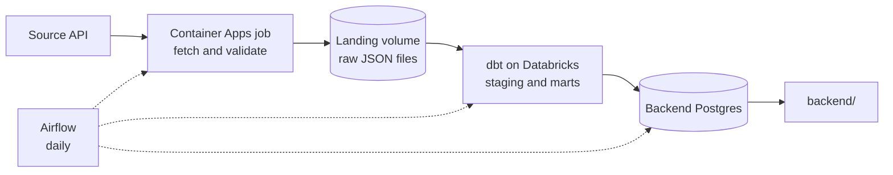

# Final Project Data Pipeline

The starting shape for the data half of the final project. It gives you the
folders, the wiring, and the conventions. It does not give you a working
pipeline: the parts that matter are yours to write, and they are marked `TODO`
with a docstring saying what each one has to do.

## The pipeline you are building



Every team runs this shape: ingestion in a container, raw files in your team's
landing volume, dbt building models in your team's catalog, and Airflow
publishing the finished mart into the database the backend reads.

Raw files go to `/Volumes/<your catalog>/landing/raw/`. The volume already sits
inside your catalog, so the permissions that protect your tables protect your
raw files too, and there is no separate storage account to create or secure.

## What you get, and what you write

| Path | State |
|---|---|
| `src/config.py` | **Done.** Reads settings from the environment and fails loudly when one is missing |
| `src/models.py` | **Example.** A Pydantic model for job postings. Replace it with your source's shape |
| `src/ingest.py` | **Done.** Calls the API, validates, counts rejects |
| `src/storage.py` | **You write it.** Land raw JSON in your team's volume |
| `src/sync.py` | **You write it.** Publish a mart into the backend's database |
| `src/pipeline.py` | **Done.** Wires fetch, validate and land together |
| `dbt/models/staging/` | **Skeleton.** Reads the volume with `read_files`. Rename to your domain |
| `dbt/models/marts/fct_postings.sql` | **Skeleton.** This is the contract with the backend |
| `dbt/tests/` | **Example.** Two custom tests, including a zero-row check |
| `airflow/dags/pipeline_dag.py` | **Skeleton.** Three tasks wired in order, bodies empty |
| `Dockerfile` | **Done.** The image you push to Azure Container Registry |
| `optional/` | A Streamlit operations dashboard. Not required |

## Getting started

```bash
cd data
cp .env.example .env             # then fill in your catalog and team credentials
uv venv && uv pip install -e ".[dbt,sync]"

docker compose up -d backend-db  # stands in for the backend database
```

Your team's Databricks client id and secret live in Key Vault. Read them with
your own Azure login:

```bash
az keyvault secret show --vault-name kv-hyf-data \
  --name fp-databricks-client-id-team-a --query value -o tsv
```

Your first goal is one file in the volume. Implement `get_token`,
`volume_path` and `land_raw_json`, run `uv run python -m src.pipeline`, then
check it landed:

```sql
SELECT count(*) FROM read_files('/Volumes/team_a/landing/raw/postings',
                                format => 'json');
```

Everything else builds on that.

Then point `landing_path` in `dbt/dbt_project.yml` at your volume and run
`cd dbt && uv run dbt build`. When staging reads your own file, you have an end
to end path, and the rest is shaping.

## Making it yours

The template ships a job-postings example so the shape is concrete. Swapping in
your team's source is four edits:

1. `.env`: point `SOURCE_API_URL` and `SOURCE_NAME` at your source.
2. `src/models.py`: change the model to match your records.
3. `dbt/models/`: rename the models and columns to your domain.
4. `dbt/models/marts/_fct_postings.yml`: rewrite the contract.

Do this in your first two days. Everything after that builds on the shape you
choose here.

> Verify your source before you commit to it: call it once, print a record, and
> confirm you can parse it. An idea you love with a source you cannot reach is
> worth less than a plain idea that works.

## The mart is a contract

`fct_postings` is what the backend reads. Airflow copies it into their database
after dbt succeeds, so whatever you select there is what they get. Adding a
column is safe. Renaming or removing one breaks them, so agree it first and
change both sides at once.

Every column is documented in `dbt/models/marts/_fct_postings.yml`. Hand that
file to the backend trainees on day one and they can write endpoints before
your pipeline is finished. See `docs/mart_contract.md` for how to work on it
together.

## Secrets

No credentials live in this folder. `dbt/profiles.yml` is committed on purpose:
every value in it comes from `env_var(...)`, so it holds nothing secret. Real
values live in `.env`, which is git-ignored, in Key Vault, and in your team's
Databricks secret scope.

Never commit `.env`, and never paste a token or connection string into a chat
message or an LLM prompt.
