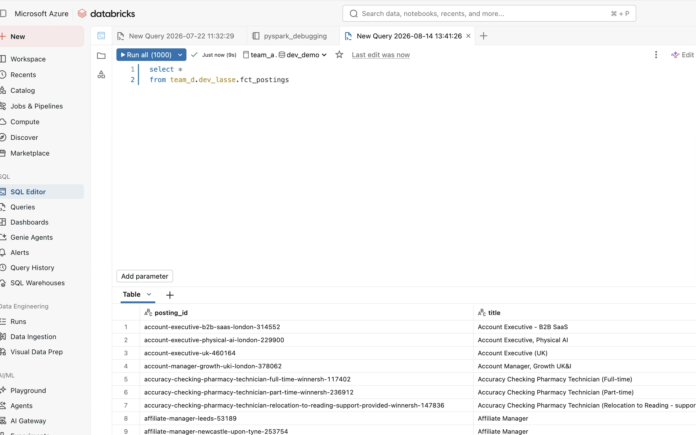
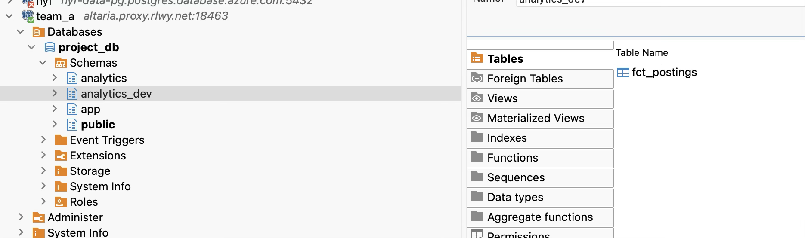

# Verifying the dev pipeline end to end

You are in the **data** folder of your team's final-project repository. This
is where the data engineering track lives: Python for ingestion, dbt for
transformations, and Airflow for scheduling. Together they form a pipeline
that fetches job postings from an external source, turns them into clean
tables on Databricks, and publishes those tables to Postgres so the backend
and frontend can use them.

**What the pipeline is trying to do:** move real data from "raw file on
storage" to "rows a user can see in the app", reliably and on a schedule.
Your team shares the cloud resources (Azure storage, Databricks, a database);
your personal setup uses the same code with your own prefix so you do not
step on each other's work.

**What you will learn from this guide:**

- how each stage fits together — ingest, transform, publish, and (later) orchestrate
- how to run the pipeline on your laptop before anything reaches production
- how to check that the *right* data arrived, not just that a command exited without an error
- how local development relates to the scheduled run on your team's Airflow VM

Work through the sections in order. They start with one-time setup, then run
each step by hand, then run the same steps through Airflow. Near the end you
will run four simple SQL checks — those are how you prove the chain actually
worked.

**Team-a walkthrough.** Commands and URLs below use team-a's resources
(`sthyffpteama`, `team_a`, `rg-hyf-fp-team-a`, `acrhyffpa`,
`vm-hyf-team-a`). On team-b, team-c, or team-d, run the same steps and swap
those names — see the table in [`../README.md`](../README.md#setup). Personal
settings (`LANDING_PREFIX`, `DBT_SCHEMA`, `dev_<yourname>`) stay yours on
every team.

## Preflight

Five minutes here saves an hour of reading logs.

Before you run these checks, mint your **personal Databricks token** in the
Databricks UI. For the exact steps, use this [Databricks token guide](https://app.notion.com/p/hackyourfuture/dbt-on-Databricks-29b30fd621bc487bb0cbb94d5de9e9d7?source=copy_link#a7646c9be2864658ac0d96ed0d33a281).

If you work in multiple Azure tenants, set `AZURE_TENANT_ID` in `data/.env`
to your HYF tenant. `scripts/preflight.sh` will validate your active `az`
session against that tenant before running storage checks.

Before running `scripts/preflight.sh`, initialize and load your local env:


|                 |                                                                                                         |
| --------------- | ------------------------------------------------------------------------------------------------------- |
| Where this runs | Your terminal, from the repository root.                                                                |
| What it does    | Creates `data/.env` from the template, loads it into your shell, then runs the preflight checks script. |


```bash
# from repository root
cd data

# Creates your personal .env from the tracked template. This file is
# gitignored — it holds your own tokens and prefix, not shared config.
cp .env.example .env

# <-- pause here and fill in the required values in .env before continuing

# Loads .env into this shell so the checks below can use its values.
source .env
cd ..

# Runs the checks in the table below: Azure session, Databricks token,
# warehouse reachability, Postgres connectivity, and settings alignment.
scripts/preflight.sh
```

Also copy the Astro settings template once, so local Airflow starts with
`INGEST_MODE=local` by default instead of Astro's own fallback (`aca`):


|                 |                                                                                                                                                         |
| --------------- | ------------------------------------------------------------------------------------------------------------------------------------------------------- |
| Where this runs | Your terminal, in `data/airflow`.                                                                                                                       |
| What it does    | Creates `airflow_settings.yaml` (gitignored, since it is also where Connections/Pools with real secrets can live) from the tracked `.example` template. |


```bash
cd data/airflow

# airflow_settings.yaml itself is gitignored (it can hold Connection/Pool
# secrets later), so every dev makes their own copy from the tracked
# .example once. Astro reads it on every `astro dev start`/`restart`.
cp airflow_settings.yaml.example airflow_settings.yaml
```


| Check                  | Command                | Expected                                                                       |
| ---------------------- | ---------------------- | ------------------------------------------------------------------------------ |
| Signed in to Azure     | `az login`             | your HYF tenant                                                                |
| Databricks token alive | `scripts/preflight.sh` | prints `Databricks token check passed (HTTP 200).`                             |
| Warehouse reachable    | `scripts/preflight.sh` | `dbt debug` passes (`All checks passed!`)                                      |
| Postgres up            | `scripts/preflight.sh` | prints the `\dn` schema list for your configured database                      |
| Settings agree         | `scripts/preflight.sh` | prints alignment status; warns on prefix mismatch (valid for Mode 2 `aca-dev`) |


## Path A: the four steps by hand

Fastest loop while you are changing code. Each step is a command, and each one
is the same code the DAG runs.

#### Step 1: ingest a file into the landing path

For a refresher on ingestion take a look at [Week 3 again](https://app.notion.com/p/hackyourfuture/Week-3-Ingesting-and-Validating-Data-2f550f64ffc98013ac49cbf8305a949f?source=copy_link) or look at your week 7 project on how you handled the ingestion of the data. The following command runs the ingestion pipeline, landing a file in your personal prefix on the team storage account.


|                 |                                                                                                                             |
| --------------- | --------------------------------------------------------------------------------------------------------------------------- |
| Where this runs | Your terminal, in the `data` folder.                                                                                        |
| What it does    | Loads `data/.env`, then runs `src/ingestion/pipeline.py` via `python -m src.ingestion.pipeline` to fetch and land raw data. |


```bash
# Loads data/.env into this shell so the pipeline reads your personal
# LANDING_PREFIX, source URL, and credentials — same as Airflow does.
cd data && set -a && . ./.env && set +a

# 1. Fetch the source and land one raw file
uv run python -m src.ingestion.pipeline
```

The last two lines tell you the count and the exact path:


|                              |                                                                                               |
| ---------------------------- | --------------------------------------------------------------------------------------------- |
| Where this output comes from | `src/ingestion/pipeline.py` logs.                                                             |
| What it means                | Rows were landed to the storage prefix and the pipeline finished with landed/rejected counts. |


```text
landed 175 records, 1411925 bytes, to dev/<your-prefix>/postings/... on sthyffpteama
Pipeline finished: 175 landed, 0 rejected, readable at /Volumes/team_a/landing/dev/<your-prefix>/postings
```

A non-zero reject count is worth reading before you go on: it means records
arrived that your Pydantic model would not accept.

#### Confirm the data landed in the dev container in Azure


|                 |                                                                                                                        |
| --------------- | ---------------------------------------------------------------------------------------------------------------------- |
| Where this runs | Your terminal, after step 1.                                                                                           |
| What it does    | Lists blobs under your `LANDING_PREFIX` in the `dev` container to prove files were written and to show size/timestamp. |


```bash
# 2. Confirm the bytes exist, and when they were written.
# Uses your `az login` session (--auth-mode login), and $LANDING_PREFIX from
# the .env you loaded in step 1, so this lists exactly what you just wrote.
az storage blob list --account-name sthyffpteama --container-name dev \
  --prefix "$LANDING_PREFIX" --auth-mode login \
  --query "[].{name:name,modified:properties.lastModified,bytes:properties.contentLength}" -o tsv
```

Next, to double-check, [open the team storage account in Azure Portal](https://portal.azure.com/#@hackyourfuture.nl/resource/subscriptions/1120c89d-2a5f-4a15-a582-2ea34f0bb5c3/resourceGroups/rg-hyf-fp-team-a/providers/Microsoft.Storage/storageAccounts/sthyffpteama/containersList).

#### Run dbt in Databricks

For refresher take a look at week 13's chapter [dbt on Databricks](https://app.notion.com/p/hackyourfuture/dbt-on-Databricks-29b30fd621bc487bb0cbb94d5de9e9d7?source=copy_link) again


|                 |                                                                 |
| --------------- | --------------------------------------------------------------- |
| Where this runs | Your terminal, in `data/dbt`.                                   |
| What it does    | Builds dbt models and runs tests in your Databricks dev schema. |


```bash
# 3. Build the models and run the tests.
# --project .. points dbt at data/dbt/dbt_project.yml, while `uv run` still
# resolves dependencies from data/pyproject.toml one level up.
cd dbt && uv run --project .. dbt build
```

You are looking for a successful summary at the end of the run, for example:


|                              |                                                    |
| ---------------------------- | -------------------------------------------------- |
| Where this output comes from | `dbt build` terminal summary.                      |
| What it means                | Model builds and tests all completed successfully. |


```text
Finished running 3 table models, 32 data tests, 2 view models in 0 hours 1 minutes and 34.91 seconds (94.91s).
Completed successfully
```

If you see `ERROR` or `SKIP`, treat it as a failure: a skipped test often means
an upstream model failed and the test that would have caught the real problem
never ran.

#### Check results in Databricks Catalog

To confirm the table exists in Databricks Catalog Explorer after the build,
open your dev schema and table in the browser. Example (team-a, `dev_<yourname>`):

[See fct_postings in team_a.dev_<yourname> (Databricks Catalog Explorer)](https://adb-7405619530719547.7.azuredatabricks.net/explore/data/team_a/dev_<yourname>/fct_postings?o=7405619530719547) in databricks.

Query your mart to confirm the row count and the latest ingestion timestamp:


|                 |                                                   |
| --------------- | ------------------------------------------------- |
| Where this runs | Databricks SQL editor on your warehouse.          |
| What it does    | Inspects the built mart table in your dev schema. |


```sql
-- Replace dev_<yourname> with your own dev schema (dev_<yourname>).
select * 
from team_a.dev_<yourname>.fct_postings
```



#### Publish your databricks mart to Postgres dev schema

This step exists because your backend reads from Postgres, not from Databricks.
After dbt builds the mart in your Databricks dev schema, you still need to copy
that result into `analytics_dev.fct_postings` so the backend sees the same data.

We use the Python publish script (instead of a one-off SQL copy) because it is
the exact same code path the DAG uses in production. That gives you consistent
behavior between manual runs and scheduled runs, and it uses the same
`BACKEND_PG_*` settings every time. `--mart`, `--table`, and `--schema` let you
override defaults when your team renames its domain.

The script also protects you from destructive mistakes: it refuses to publish
an empty mart over a populated Postgres table. If you see
`refusing to publish an empty mart`, treat it as a signal that step 3 did not
build the expected data.


|                 |                                                                                                                   |
| --------------- | ----------------------------------------------------------------------------------------------------------------- |
| Where this runs | Your terminal, from `data`.                                                                                       |
| What it does    | Executes `src/publishing/sync.py` to read from Databricks and publish into Postgres `analytics_dev.fct_postings`. |


```bash
# 4. Replace the backend's copy of the mart.
# Reads team_a.dev_<yourname>.fct_postings_enriched from Databricks and
# overwrites analytics_dev.fct_postings in Postgres — refuses to run if the
# source mart is empty, so it never wipes a good table with nothing.
cd .. && uv run python -m src.publishing.sync
```

It prints what it read and what it wrote:


|                              |                                                                  |
| ---------------------------- | ---------------------------------------------------------------- |
| Where this output comes from | `src/publishing/sync.py` logs.                                   |
| What it means                | The script read rows from Databricks and wrote rows to Postgres. |


```text
read 300 rows and 12 columns from team_a.dev_<yourname>.fct_postings_enriched
published 300 rows to analytics_dev.fct_postings

```

See results in Dbeaver after you've published and setup dbeaver connection with the backend database settings in your `.env` file. Query the mart table to confirm the row count and the latest ingestion timestamp:



### Airflow: Why use Airflow after scripts are green

This section is written for first-time students following the flow end to end.
If you hit an unexpected runtime error, treat it as a project issue for
maintainers to fix, not as a student exercise to patch infrastructure.

Running ingestion, dbt, and publish scripts by hand proves your code logic.
Running through Airflow proves you can handle orchestration logic. You need both.

Airflow validates things the script-only flow cannot validate:

- task dependencies and execution order (`ingest` -> `dbt_build` ->
`publish_to_backend`)
- runtime environment in containers (paths, packages, env names)
- scheduler behavior (manual trigger vs scheduled run)
- task-level observability in one place (retry state, task logs, duration)

In short: scripts prove each component works; Airflow proves the full pipeline
is runnable the way it will run in operations.

Now we will discuss 2 modes of running the DAG in Airflow: Mode 1 (local Python ingestion) and Mode 2 (Azure Container Apps (ACA) ingestion). Mode 1 is for quick local iteration only to test that all the scripts work, while Mode 2 is for running the full containerized/dockerized end-to-end pipeline with the ACA job, which you will also use in development *and* production.

### Mode 1: run local Python ingest as an Astro DAG (no ACA)

Use this mode first. The DAG still orchestrates all three tasks, but `ingest`
runs local Python code inside the Airflow worker instead of triggering ACA.

1. Start Astro locally.


|                 |                                                                                                                                                  |
| --------------- | ------------------------------------------------------------------------------------------------------------------------------------------------ |
| Where this runs | Your terminal, in `data/airflow`.                                                                                                                |
| What it does    | Starts local Airflow services and loads your project code. Variables are loaded from `data/.env` via `data/airflow/docker-compose.override.yml`. |


```bash
cd data/airflow

# `restart` (not `start`) forces a full recreate, so code, env vars, and
# airflow_settings.yaml are all reloaded fresh before you trigger anything.
astro dev restart
```

Use `astro dev restart` (not `start`) in this guide so your environment and
dependencies are always refreshed before you run the DAG.

1. Confirm Airflow Variable `INGEST_MODE=local`.


|                 |                                                                                                       |
| --------------- | ----------------------------------------------------------------------------------------------------- |
| Where this runs | The Airflow UI URL printed by `astro dev restart` (see the port trap below) under Admin -> Variables. |
| What it does    | Makes the DAG task `ingest` execute `src/ingestion/pipeline.py` locally in the worker.                |


`astro dev restart` sets this for you automatically from
`data/airflow/airflow_settings.yaml`, which defaults `INGEST_MODE` to
`local` on every local dev environment. You only need to check it here if you
previously switched it to `aca` for Mode 2 and want to switch back.

1. Ensure your local landing prefix is active.


|                 |                                                                    |
| --------------- | ------------------------------------------------------------------ |
| Where this runs | Airflow UI (Admin -> Variables) or your `.env` file used by Astro. |
| What it does    | Keeps ingestion and dbt pointed at your personal dev prefix.       |


- Use your normal dev values for `LANDING_PREFIX` and `LANDING_PATH`.
- Do not point `LANDING_PATH` to `aca-dev` in Mode 1.

1. Run the DAG in Graph view.


|                 |                                                                    |
| --------------- | ------------------------------------------------------------------ |
| Where this runs | Airflow UI for `final_project_pipeline`.                           |
| What it does    | Executes `ingest` -> `dbt_build` -> `publish_to_backend` in order. |


- Open `DAGs` in the top menu and search for `final_project_pipeline`.
- Toggle the DAG from `Paused` to `Unpaused`.
- Click the DAG name to open it, then click `Graph`.
- To run the full flow: click the play button (`Trigger DAG`) in the top-right.
- To run step-by-step: click each task node and choose `Run`, in this order:
`ingest` -> `dbt_build` -> `publish_to_backend`.
- Wait for each task to turn green (`success`) before running the next one.

1. Validate logs and backend result.


|                 |                                                              |
| --------------- | ------------------------------------------------------------ |
| Where this runs | Airflow task logs and your Postgres SQL client.              |
| What it does    | Confirms the local-ingest DAG path produced rows end to end. |


- In `ingest` logs, verify local pipeline output (landed records message).
- In `dbt_build` logs, verify `Completed successfully`.
- In `publish_to_backend` logs, verify `published ... rows`.

```sql
-- rows == ids confirms de-duplication held; max(ingested_at) should match
-- the time your DAG run's ingest task actually finished.
select count(*) as rows,
       count(distinct posting_id) as ids,
       max(ingested_at) as latest
from analytics_dev.fct_postings;
```

Mode 1 exit criteria: DAG run succeeds with `INGEST_MODE=local`, and publish
logs plus Postgres checks confirm fresh rows.

### Mode 2: run Astro DAG with ACA ingest

After Mode 1 is green, switch the same DAG to ACA-backed ingest for full
integration validation. This continues directly from Mode 1 — Astro is
already running, so you do not stop or re-`start` it here. You only need one
more restart, to pick up the `.env` and `airflow_settings.yaml` changes in
step 1.

Mode 2 does not build or deploy anything. The `ingest` task only starts an
existing Container Apps job (`ACA_INGEST_JOB`, default `job-fp-ingest-dev`)
and waits for it — it does not push a new image or create the job if either
is missing. CI only builds and deploys on merge to `main`, and only to the
production job (`job-fp-ingest`), so `job-fp-ingest-dev` keeps running
whatever image you last pointed it at until you update it yourself.

That means: if you skip straight to triggering the DAG, `ingest` may run
against a stale image that predates the change you are trying to test — a
green `ingest` task tells you the *old* code still works, not that your
current code does. Build, push, and start the dev job by hand first, so a
failure here is one line of `az` output instead of a task log three clicks
deep in the Airflow UI.

#### Step 0: build, push, and verify the dev ingestion image


|                 |                                                                                                                                                                                                         |
| --------------- | ------------------------------------------------------------------------------------------------------------------------------------------------------------------------------------------------------- |
| Where this runs | Your terminal, in `data`.                                                                                                                                                                               |
| What it does    | Builds the ingestion image from your current working tree, pushes it to your team's registry, points the dev Container Apps job at it, and starts one execution so you see it work before Airflow does. |


For **team-a**, the resource group is `rg-hyf-fp-team-a`, the registry is
`acrhyffpa`, and the dev job is `job-fp-ingest-dev` — all in `data/.env.example`.
On another team, update those four identifiers in `.env` first; the commands
below are otherwise the same.

```bash
cd data

# Load ACR_NAME, AZURE_RESOURCE_GROUP, ACA_INGEST_JOB, and everything else in
# .env into this shell, so the commands below need no manual substitution.
set -a && . ./.env && set +a

# Authenticates docker to push to your team's registry. Uses your `az login`
# session, so run `az login` first if this fails.
az acr login --name "$ACR_NAME"

# Tag by username so two teammates building at the same time do not clobber
# each other's image, and so `docker images` shows whose build is whose.
tag="dev-$(whoami)"

# --platform linux/amd64 matters on Apple Silicon: a plain `docker build`
# there produces an arm64 image, and `containerapp job update` rejects it
# with "no child with platform linux/amd64 in index ...". buildx --push does
# the build and push in one step and always targets amd64 here.
docker buildx build --platform linux/amd64 \
  -t "$ACR_NAME.azurecr.io/pipeline:$tag" --push .

# Points the dev Container Apps job at the image you just pushed, so the next
# `job start` (here or from Airflow) runs your current code, not whatever was
# pushed last.
az containerapp job update -g "$AZURE_RESOURCE_GROUP" -n "$ACA_INGEST_JOB" \
  --image "$ACR_NAME.azurecr.io/pipeline:$tag"
```

Start it and watch it run, the same way the DAG's `ingest` task will:

```bash
# Starts one execution of the image you just pushed. Returns immediately —
# the job runs in Azure, not in this terminal.
az containerapp job start -g "$AZURE_RESOURCE_GROUP" -n "$ACA_INGEST_JOB"

# The most recent execution is always index [0]. Re-run this until status is
# Succeeded or Failed — it stays "Running" for the ~20-30s the job takes.
az containerapp job execution list -g "$AZURE_RESOURCE_GROUP" -n "$ACA_INGEST_JOB" \
  --query "[0].{status:properties.status,start:properties.startTime}" -o tsv
```

Watch the logs of that run, either from your terminal or in the Portal:

```bash
# Streams the log lines from the container. Works for a short window after
# the run finishes — the replica is cleaned up soon after, and once it is,
# this errors with "No replicas found for execution" instead of showing logs.
az containerapp job logs show -g "$AZURE_RESOURCE_GROUP" -n "$ACA_INGEST_JOB" \
  --container "$ACA_INGEST_JOB" --tail 50
```

```bash
# Prints the job's Portal URL. Open it, then click "Execution history" in the
# left nav and pick your run — its Logs tab stays available longer than the
# CLI's live-replica log stream above.
id=$(az containerapp job show -g "$AZURE_RESOURCE_GROUP" -n "$ACA_INGEST_JOB" --query id -o tsv)
echo "https://portal.azure.com/#@hackyourfuture.nl/resource${id}"
```

> This should produce the url of the [ACA container](https://portal.azure.com/#@hackyourfuture.nl/resource/subscriptions/1120c89d-2a5f-4a15-a582-2ea34f0bb5c3/resourceGroups/rg-hyf-fp-team-a/providers/Microsoft.App/jobs/job-fp-ingest-dev/executionHistory) and you can view the execution history and logs of the ingestion job. You can also view the logs of the ingestion job in the portal.

If it fails here, fix it here — reading `az containerapp job logs show` output
is faster than reading the same failure surfaced through an Airflow task log.
Only move on to triggering the DAG once this direct run succeeds and writes a
fresh blob under your ACA landing prefix (see assertion 2 below).

#### How Mode 2 DAG loads your code

In your pipeline you have different steps, all of them include code. You start with your Python ingestion code, then you have your dbt code and finally your publishing Python code. To Airflow, it doesn't matter *where* the code lives, either in a python file or a dbt project, or even in a remote ACA container. The DAG in Airflow can orchestrate all of these steps, but the way it runs them is different for each step:


| Task                 | Code                                                            | Who actually runs it                                                                                                                                                                     |
| -------------------- | --------------------------------------------------------------- | ---------------------------------------------------------------------------------------------------------------------------------------------------------------------------------------- |
| `ingest`             | `src/ingestion/pipeline.py`, packaged into the `pipeline` image | Outside service — with `INGEST_MODE=aca`, Airflow only starts/polls the Container Apps job; the container executes the code                                                              |
| `dbt_build`          | `data/dbt` project, mounted into the worker                     | It's a mix: airflow itself — runs `dbt build` as a subprocess in the worker container, which submits the SQL/Python to Databricks, but Databricks then actually executes the SQL/Python. |
| `publish_to_backend` | `src/publishing/sync.py`, mounted into the worker               | Airflow itself: it runs the Python script as a subprocess in the worker container                                                                                                        |


**Why** `dbt_build` **has no ACA job or image of its own, while** `ingest` **does.**
`dbt build` is a subprocess Airflow runs directly inside its own worker
container — dbt itself does almost no computation locally. It compiles your
SQL/Python models and submits them to your Databricks SQL warehouse, which
does the actual building and testing over the network. The worker just needs
the `dbt` CLI installed and network access to Databricks, both of which the
Airflow image already has, so there is nothing extra to package or deploy.

`ingest`, by contrast, needs to run unattended on a fixed schedule
independent of whether Airflow (or your laptop) is even running, and it needs
its own dependency set (the source API client, `azure-storage-blob`) isolated
from Airflow's. A Container Apps job is a separate deployable unit built for
exactly that: a scheduled or on-demand container run that lives on its own,
which is why ingestion gets an image and a job and dbt does not. The benefit is that the ACA container has all the dependencies it needs, so your Airflow worker does not need to have them installed, and the ACA job can run on a schedule indepependently even if your Airflow instance is down or has issues. This way we are using Airflow as an orchestrator, and not as a compute engine for the ingestion step.

**Why** `publish_to_backend` **runs in Airflow, not in ACA or in Databricks/dbt.**
`src/publishing/sync.py` needs two things that neither ACA nor Databricks
naturally gives it: read access to the Databricks warehouse (to pull the
built mart) and write access to Postgres (to push it), in one process. Databricks
can run SQL and dbt models, but it has no first-class way to open a
connection out to an arbitrary external Postgres database as part of a model
build — dbt materializes tables in your warehouse; it does not publish them
elsewhere. Pushing this into its own ACA job like `ingest` would work, but
would buy nothing: unlike ingestion, publish has no separate dependency set
worth isolating and no need to run unattended on its own schedule — it only
ever runs right after `dbt_build` finishes, as the last link in the same
chain. Since Airflow's worker already runs Python subprocesses (as
`dbt_build` does) and already has network access to both Databricks and
Postgres, publish just reuses that path instead of paying for a second
container image and job it does not need.

Now, if you switch `INGEST_MODE` back to `local`, the same DAG runs local Python
ingestion instead of ACA.

1. Point `LANDING_PATH` at the ACA prefix in `data/.env`, and set
  `INGEST_MODE=aca` in `data/airflow/airflow_settings.yaml`.


|                 |                                                                                                                                                                                                                       |
| --------------- | --------------------------------------------------------------------------------------------------------------------------------------------------------------------------------------------------------------------- |
| Where this runs | `data/.env` and `data/airflow/airflow_settings.yaml`, edited in your editor.                                                                                                                                          |
| What it does    | Changes where `dbt_build` reads landed files from (so it reads what the ACA ingest job writes, not your personal dev prefix), and switches the value Astro seeds `INGEST_MODE` with on startup from `local` to `aca`. |


`LANDING_PATH` is read straight from the environment, not from an Airflow
Variable, so it can only be changed in `.env` — setting it in the Airflow UI
has no effect. `INGEST_MODE` normally lives as an Airflow Variable, but
`astro dev restart` re-seeds Variables from `airflow_settings.yaml` on every
restart (that is what makes `INGEST_MODE=local` the default in the first
place — see Preflight), so editing that file directly means one restart picks
up both changes instead of restarting once for `.env` and then hunting down
the UI to re-set a Variable that a stray restart would silently wipe again.

```bash
# in data/.env
# Points dbt_build's read at the folder the ACA job writes to, not your
# personal dev prefix — the two are different paths under the same volume.
LANDING_PATH=/Volumes/team_a/landing/dev/aca-dev/postings
```

```yaml
# in data/airflow/airflow_settings.yaml
# Change variable_value from `local` to `aca` — this is the same file
# Preflight had you copy from the .example.
airflow:
  variables:
    - variable_name: INGEST_MODE
      variable_value: aca
```

1. Restart Astro so both changes take effect:


|                 |                                                                                                                                                                                                                       |
| --------------- | --------------------------------------------------------------------------------------------------------------------------------------------------------------------------------------------------------------------- |
| Where this runs | Your terminal, in `data/airflow`.                                                                                                                                                                                     |
| What it does    | Recreates the local Airflow services so the updated `LANDING_PATH` is loaded into the containers via `data/airflow/docker-compose.override.yml`, and re-seeds `INGEST_MODE` from your edited `airflow_settings.yaml`. |


```bash
cd data/airflow

# One restart, after both edits above, applies both — no need to set
# INGEST_MODE separately in the UI, and no risk of a later restart reverting
# it back to `local` behind your back.
astro dev restart
```

You can still set `INGEST_MODE` directly in the Airflow UI (Admin ->
Variables) at the URL printed by `astro dev restart` (see the port trap
below; do not assume it is always `airflow.localhost:6563`) if you want to
flip it without touching files — just remember that value is UI-only and
reverts to whatever `airflow_settings.yaml` says on your next restart.

1. In the local Airflow UI, run tasks from the DAG interface.


|                 |                                                                                      |
| --------------- | ------------------------------------------------------------------------------------ |
| Where this runs | Airflow web UI for `final_project_pipeline`.                                         |
| What it does    | Lets you run and inspect `ingest`, `dbt_build`, and `publish_to_backend` one by one. |


- Open `DAGs` in the top menu and search for `final_project_pipeline`.
- Toggle the DAG from `Paused` to `Unpaused`.
- Click the DAG name, then open `Graph` view.
- Click the play button (`Trigger DAG`) to run the full flow.
- Or run step-by-step: click task node -> `Run`, in this order:
`ingest` -> `dbt_build` -> `publish_to_backend`.
- Confirm each task reaches `success` before moving to the next task.

1. Check task logs after each step.


|                 |                                                          |
| --------------- | -------------------------------------------------------- |
| Where this runs | Airflow task instance view in the UI.                    |
| What it does    | Shows the exact command output and errors for each task. |


- Click a task node in Graph view.
- Open the current task instance.
- Click `Log`.
- Confirm expected signals:
  - `ingest`: container job execution succeeded.
  - `dbt_build`: dbt summary ends with `Completed successfully`.
  - `publish_to_backend`: logs include `published ... rows to analytics_dev.fct_postings`.

1. Confirm the publish landed in Postgres dev schema:


|                 |                                                                                               |
| --------------- | --------------------------------------------------------------------------------------------- |
| Where this runs | Your Postgres SQL client against the backend database.                                        |
| What it does    | Validates row count, distinct IDs, and newest ingestion time in `analytics_dev.fct_postings`. |


```sql
-- Same check as Mode 1, but latest should now match the ACA job's finish
-- time from Step 0 (or the DAG's ingest task), not a local pipeline run.
select count(*) as rows,
       count(distinct posting_id) as ids,
       max(ingested_at) as latest
from analytics_dev.fct_postings;
```

If `publish_to_backend` fails with empty-mart protection, re-check `dbt_build`
output in the DAG run and verify your Databricks dev schema table has rows.

If any Mode 2 task fails with an unexpected dependency/runtime error, stop and
share logs with maintainers. Students should not need to patch image/runtime
configuration.

## Next: Promoting to Production

Once Mode 2 is green and the four assertions pass, "promoting to production"
is not a separate deploy step you run: it is merging your pull request. The
DAG file, the dbt project, and the ingestion image are exactly what you just
tested; nothing gets rebuilt differently for prod, and nothing that deploys
in this section is a command you type from your own machine — Azure CLI and
`az containerapp`/`az acr` access to prod resources is deliberately not
handed to a laptop. The prod Airflow **UI** is the exception: it is a normal
website, and you reach it with your own browser and your own login (see
"Logging in" below).

**You do not have to write any code to see the prod pipeline work.** A
working starter version of every part — the `ingest` container image,
the dbt models, the DAG, and the publish script — has already been built and
deployed for you, the same way CI/CD builds and deploys it after every merge.
The very first thing to do here is **run the pipeline as it already exists**
and confirm it end to end, before you change anything. That gives you a
known-good baseline: if something breaks later, you will know it was your
change, not a broken starting point.

Every resource the prod run touches has a different name from the one you
have been using in Mode 1/Mode 2, on purpose — the split enforces that a
laptop and the scheduled run can never collide:


| Layer                    | Your dev run                              | The prod run                                          |
| ------------------------ | ----------------------------------------- | ----------------------------------------------------- |
| ACA ingestion job        | `job-fp-ingest-dev`                       | `job-fp-ingest`                                       |
| Storage container (ADLS) | `dev` (prefix `<your-name>` or `aca-dev`) | `prod` (prefix `raw`)                                 |
| Databricks schema        | `dev_<yourname>`                          | `analytics`                                           |
| Airflow                  | your local Astro, `astro dev ps` URL      | `https://vm-hyf-team-a.westeurope.cloudapp.azure.com` |
| Postgres schema          | `analytics_dev`                           | `analytics`                                           |


The team-a prod Airflow is at
`[vm-hyf-team-a.westeurope.cloudapp.azure.com](https://vm-hyf-team-a.westeurope.cloudapp.azure.com)`.
The other three teams' prod Airflow instances follow the same pattern
(`vm-hyf-team-a`/`b`/`c`), so if you ever see a URL from another team's
screen share, do not assume it is yours.

**Logging in.** Each student gets their own login to their team's prod
Airflow — this is not a shared account. Your password is in Key Vault under
`fp-airflow-password-<your-name>`:

```bash
az keyvault secret show --vault-name kv-hyf-data \
  --name fp-airflow-password-<your-name> --query value -o tsv
```

There is also one shared admin login per team, `fp-airflow-admin-team-a` for
team-a, for maintainers rather than day-to-day use. Do not confuse either of
these with the older `airflow-ui-password-<name>` / `airflow-webserver-password`
secrets — those belonged to Week 12's shared class Airflow instance (now
deallocated), not the final-project team instances; `fp-airflow-*` is the
live prod set. If your `fp-airflow-password-<your-name>` secret does not exist,
ask a maintainer rather than using someone else's or the admin login.

### Step A: run the existing starter pipeline first, unchanged

Do this before touching any code. It proves the baseline works, so any
failure once you *do* change something is your change, not something that
was already broken.

1. Open the prod Airflow UI and sign in with your login from above.
2. Find `final_project_pipeline`, unpause it if it is paused, open `Graph`
  view.
3. Click `Trigger DAG` and watch all three tasks —
  `ingest` -> `dbt_build` -> `publish_to_backend` — turn green in order.
4. Confirm output landed in the shared prod Postgres schema:

```sql
-- Same shape as every other assertion in this guide, but this is the first
-- time it is run against the real prod analytics schema, so an empty result
-- here is informative, not just a formality.
select count(*) as rows,
       count(distinct posting_id) as ids,
       max(ingested_at) as latest
from analytics.fct_postings;
```

This is what a verified baseline looks like in the prod Airflow UI:

- **DAG overview** — recent runs all `Success`, zero failed task instances
- **Run history** — mix of `Manual` and `Scheduled` runs, all green
- **Task instances** (open any run) — `ingest`, `dbt_build`, and
  `publish_to_backend` each succeeded with their own duration and log link

Only once this run is green and Postgres shows fresh rows do you have a
verified baseline. From here, the rest of this section shows how a change to
each part of the pipeline — ingestion, dbt, publish — reaches that same prod
run, one small demonstration PR per part, so you see the promotion path for
each without guessing.

**If Step A does not go green** — a task fails, Variables render empty, or
Postgres stays empty after a "successful" run — this is exactly the case the
top of this section already told you: treat it as a project issue, not a
student exercise. Stop and tell a maintainer which task failed and what the
task log says, rather than trying to patch infrastructure config, Azure
roles, or Databricks/Key Vault permissions yourself.

### Step B: demonstrate a change to each part, one PR at a time

Same flow for all three: branch, make one small change, open a PR, let CI
pass, merge, then re-run the DAG in prod Airflow and confirm the change
shows up (a log line, a new column, whatever the change was).

#### Worked example: the DAG schedule change

[PR #2, "Schedule final_project_pipeline at 09:00 CET/CEST"](https://github.com/HackYourFuture/final-project-template/pull/2)
is a real, small, one-file change that walks all four steps below end to end —
use it as the template shape for your own ingestion/dbt/publish PRs.

1. **Branch and make one small change.** The change touched exactly two
  lines of `data/airflow/dags/pipeline_dag.py`: the DAG's `start_date` moved
   from a bare UTC `datetime` to `pendulum.datetime(2026, 1, 1,  tz="Europe/Amsterdam")`, and `schedule` moved from `"0 6 * * *"` to
   `"0 9 * * *"`. That is the whole diff — one file, no unrelated cleanup
   riding along.
2. **Open the PR and fill in the template.** `.github/pull_request_template.md`
  requires `## What I built`, `## Why this approach`, `## Contract impact`,
   `## How to run`, and `## Self-check` — a PR description missing any of
   these headings fails the `Description uses the template` check
   immediately, before anything about the code is even reviewed. This is a
   fast, cheap check to satisfy: copy the template, do not skip a heading.
3. **Let CI pass.** Six checks ran on this PR — what each one does and why it
  exists:

  | Check                           | Workflow          | What it does                                                                                                                                                                                                          | Why it exists                                                                                                                                                                                                                                                                       |
  | ------------------------------- | ----------------- | --------------------------------------------------------------------------------------------------------------------------------------------------------------------------------------------------------------------- | ----------------------------------------------------------------------------------------------------------------------------------------------------------------------------------------------------------------------------------------------------------------------------------- |
  | `lint-and-test`                 | `data-ci-cd.yaml` | Runs `ruff check` (lint), `black --check` (Python format), `sqlfmt --check` (SQL format), `ty check` (types), then `pytest` — five separate steps, so a failure names itself instead of hiding in one wall of output. | Catches style and correctness problems before a human reviewer has to.                                                                                                                                                                                                              |
  | `dag-integrity`                 | `data-ci-cd.yaml` | Installs the exact Airflow version prod runs, then loads every file under `data/airflow/dags` with `DagBag` and fails if any fails to import.                                                                         | A DAG that fails to import raises **no error anywhere in the Airflow UI** — it just never appears. This is the only thing that catches that failure mode before it reaches the scheduler.                                                                                           |
  | `Description uses the template` | `pr-checks.yml`   | Greps the PR description for the five required headings (`## What I built`, `## Why this approach`, `## Contract impact`, `## How to run`, `## Self-check`).                                                          | GitHub only auto-fills the template through the web "compose" form; `gh pr create --body "..."` (the path most AI tools and scripts take) silently skips it, so this check is the only thing that actually enforces it.                                                             |
  | `Diff stays reviewable`         | `pr-checks.yml`   | Counts changed lines (excluding lockfiles and generated artifacts) and fails over 400 unless the description has an `Oversized: <reason>` line.                                                                       | A huge diff does not get reviewed, it gets rubber-stamped. This forces either a smaller PR or an explicit, written reason it couldn't be split.                                                                                                                                     |
  | `build`                         | `data-ci-cd.yaml` | Builds the `pipeline` Docker image and pushes it to ACR.                                                                                                                                                              | Guarded by `if: github.event_name != 'pull_request'` — showed `skipping` here because a PR (even one from a branch of this repo) cannot mint the Azure token this step needs; the trust is pinned to a push on `main`, so the job doesn't even attempt it. Expected, not a failure. |
  | `deploy-prod`                   | `data-ci-cd.yaml` | Points the production Container Apps job at the newly built image.                                                                                                                                                    | Same guard as `build`, plus `github.ref == 'refs/heads/main'` — also `skipping` on a PR. This is what makes "merging is the deploy" literally true: the job that changes production infrastructure structurally cannot run anywhere except a push to `main`.                        |

   For this particular PR, `build`/`deploy-prod` skipping is doubly expected:
   the change only touches `pipeline_dag.py`, not `src/ingestion` — so even
   after merge, `build` produces an image identical in behavior to the last
   one, and `deploy-prod` re-points the job at a new tag that runs the same
   code.
4. **Merge, then confirm in prod Airflow.** Once merged, prod Airflow picks up
  the new `pipeline_dag.py` automatically within about a minute — no manual
   deploy step. Confirm it landed by opening
   `final_project_pipeline` in the prod Airflow UI and checking the DAG's
   **Next Run** timestamp shows 09:00 local instead of 06:00 UTC — this is
   the same "did my change actually reach prod" check as the row-count query
   for the ingestion/dbt/publish PRs, just read from the schedule instead of
   from Postgres.
   Confirmed after merging PR #2: schedule shows `09 * * *`, the latest
   scheduled run completed at `2026-08-16 09:00:00`, and Next Run reads
   `2026-08-17 09:00:00` — 09:00 local both days, not 06:00 UTC. Check
   the DAG detail page (**Next Run** column) or the Dags list view after
   any merge — both show the same schedule at a glance.

Below is what steps 2–4 of that same flow look like in more detail, for
whichever of the three PRs (ingestion, dbt, publish) you are doing next —
step 1 (branch, change, open PR, pass CI) is exactly what the worked example
above already showed, so it is not repeated here.

**Merge to** `main`**.**


|                 |                                                                                                                                                                                                                                                                                                                 |
| --------------- | --------------------------------------------------------------------------------------------------------------------------------------------------------------------------------------------------------------------------------------------------------------------------------------------------------------- |
| Where this runs | GitHub, after merge.                                                                                                                                                                                                                                                                                            |
| What it does    | Triggers the `build` job, which builds one `pipeline` image and pushes it to `acrhyffpa` tagged both `latest` and with the commit SHA, then the `deploy-prod` job, which points `job-fp-ingest` — the production Container Apps job, a completely separate job from your `job-fp-ingest-dev` — at that SHA tag. |


The two-tag choice matters for debugging later: a Container Apps job is
always pointed at the SHA tag, never `latest`, so when a number in production
looks wrong, `az containerapp job show` names the exact commit that produced
it. `deploy-prod` only runs when `github.ref == 'refs/heads/main'` — the
Azure trust is pinned to that branch, so a token exchange from a PR or a
laptop fails before any Azure call is made, which is what makes "merging is
the deploy" true rather than aspirational.

`deploy-prod` also sets these on the `job-fp-ingest` job itself, as
environment variables — not baked into the image — so the one image you
already validated against `dev` is what runs in production; only the target
it writes to changes:

- `LANDING_CONTAINER=prod` — the **prod ADLS container** on `sthyffpteama`,
distinct from the `dev` container Mode 1/Mode 2 write to.
- `LANDING_PREFIX=raw` — replaces your personal `LANDING_PREFIX`.

**The scheduled DAG run in prod does the rest — no image change.**


|                 |                                                                                                                                                                                                                                                                                                                             |
| --------------- | --------------------------------------------------------------------------------------------------------------------------------------------------------------------------------------------------------------------------------------------------------------------------------------------------------------------------- |
| Where this runs | The prod Airflow UI, `[vm-hyf-team-a.westeurope.cloudapp.azure.com](https://vm-hyf-team-a.westeurope.cloudapp.azure.com)` — not your laptop, not Astro — running unattended on the schedule set in `pipeline_dag.py` (currently `0 9 * * *`, `Europe/Amsterdam` — see "The scheduled trigger, and how to change it" below). |
| What it does    | Runs the identical DAG file you tested in Mode 2, with `INGEST_MODE=aca` and `ACA_INGEST_JOB=job-fp-ingest` (the **prod ACA job**, set as an Airflow Variable in prod, not `.env`), reading/writing the **prod ADLS container** and building the **prod Databricks schema**, `DBT_SCHEMA=analytics`.                        |


One setting does not follow the Variables pattern: `LANDING_PATH`, like in
Mode 2, is read straight from the process environment by dbt's Jinja
`env_var()`, never from an Airflow Variable — so you won't find it under
Admin -> Variables in prod either. If it ever needs changing, ask a
maintainer rather than looking for it in the UI.

Nothing about the DAG changes between dev and prod — same file, same task
graph. What changes is which credentials and settings it resolves at runtime:
`dbt_build` runs with `--target prod`, which uses the team's service
principal instead of your personal Databricks token, and that principal can
write the **prod Databricks schema** `analytics` but not the `dev_`* schemas
— the mirror image of your local token. `publish_to_backend` likewise writes
the **prod Postgres schema**, `analytics`, instead of `analytics_dev`. This is
why nothing you validated locally needs "promoting" by hand: it is the same
code path, just running under different, more privileged credentials that
only exist in prod.

#### The scheduled trigger, and how to change it

The DAG's automatic trigger is set in code, in the `@dag(...)` decorator at
the top of `final_project_pipeline()` in `pipeline_dag.py`:

```python
@dag(
    dag_id="final_project_pipeline",
    ...
    start_date=pendulum.datetime(2026, 1, 1, tz="Europe/Amsterdam"),
    schedule="0 9 * * *",
    ...
)
```

Two things work together here, and both matter:

- `schedule` is a standard 5-field cron string (`minute hour day month weekday`) — `0 9 * * *` means "at minute 0 of hour 9, every day."
- Airflow evaluates that cron string **in the timezone of** `start_date`, not
in UTC. `start_date=pendulum.datetime(2026, 1, 1, tz="Europe/Amsterdam")`
is what makes `0 9 * * *` mean 09:00 Amsterdam local time (CET in winter,
CEST in summer) instead of 09:00 UTC. This is why the fix used a
`pendulum` datetime with an explicit `tz=`, not the plain
`datetime(..., tzinfo=UTC)` the DAG used before — a fixed UTC offset would
have needed manual re-editing twice a year to stay at 09:00 local across
the daylight-saving switch.

**To change the trigger time**, edit both the cron string and (if you are
switching timezones, not just the hour) the `tz=` value, then follow the
same PR flow as any other change: branch, edit, PR through the template,
merge to `main`. There is no separate "reschedule" step in the Airflow UI —
pausing/unpausing or clicking around in **Admin -> Variables** does not
change the schedule; only editing this decorator and merging does, because
the schedule lives in the DAG file itself, not in a Variable.

Unlike the `ingest` container image (built and pushed by `deploy-prod` on
merge, see "Merge to `main`" above), `pipeline_dag.py` needs no build or
image rebuild — merging a DAG change reaches prod automatically within about
a minute, with no CI/CD deploy job involved.

**Confirm it ran, the same way you did locally.**


|                 |                                                                                                                                                |
| --------------- | ---------------------------------------------------------------------------------------------------------------------------------------------- |
| Where this runs | The **prod Airflow UI** at `[vm-hyf-team-a.westeurope.cloudapp.azure.com](https://vm-hyf-team-a.westeurope.cloudapp.azure.com)`, and Postgres. |
| What it does    | The same four assertions from above, against the **prod Postgres schema** `analytics` instead of your `analytics_dev`.                         |


```sql
-- Same shape as the dev assertions, but against the shared prod schema
-- (analytics, not analytics_dev) that the scheduled run — not you — writes to.
select count(*) as rows,
       count(distinct posting_id) as ids,
       max(ingested_at) as latest
from analytics.fct_postings;
```

If this is empty or stale the morning after a merge, the fault is almost
always upstream of Airflow: check the `deploy-prod` job's summary in the
GitHub Actions run for the SHA it deployed, and check the **prod ACA job**
`job-fp-ingest`'s execution history in the Portal before looking at DAG
logs in prod Airflow — a bad merge shows up there first.

For reference, the other three teams' prod Airflow is at
`vm-hyf-team-a`, `vm-hyf-team-b`, and `vm-hyf-team-c`
(`.westeurope.cloudapp.azure.com`) — never point your DAG or CLI commands at
one of those by mistake.

## Traps

**An expired Databricks token** reports as `http-code=401, method=OpenSession`,
which reads like a network fault. Generate a new one in the Databricks UI.

`max_active_runs=1`**.** Unpausing the DAG releases a catch-up scheduled run
that takes the only slot, so your manual trigger sits in `queued` looking
hung. It is not hung. Let the first one finish or mark it failed.

**Re-pause the DAG when you are done**, or your laptop starts a container job
and wakes the warehouse every morning at 06:00.

`read_mart` **raises on zero rows**, on purpose: publishing an empty mart over
a full one is worse than failing. So a publish failure usually means the
enrichment model did not build. Diagnose it at the dbt end.

**One file per source per day.** Re-running the same day replaces that day's
file rather than adding to it, which is why a second run does not double your
row count.

**The Airflow UI port is not always** `6563`**.** Astro assigns a local port per
project on startup, and if you have more than one Astro project directory (or
a stale one still running from a previous session), you can end up with
several `astro`/Airflow container stacks at once, each on a different port. A
URL like `http://airflow.localhost:6563/...` that used to work can silently
stop resolving to your current project. After `astro dev restart`, use the
URL/port it prints, or run `astro dev ps` from `data/airflow` to see the port
mapped to `api-server`. If you have stray stacks from old sessions, stop them
with `astro dev stop` (or `docker ps` to find and remove leftover
containers) so you are not debugging the wrong instance.